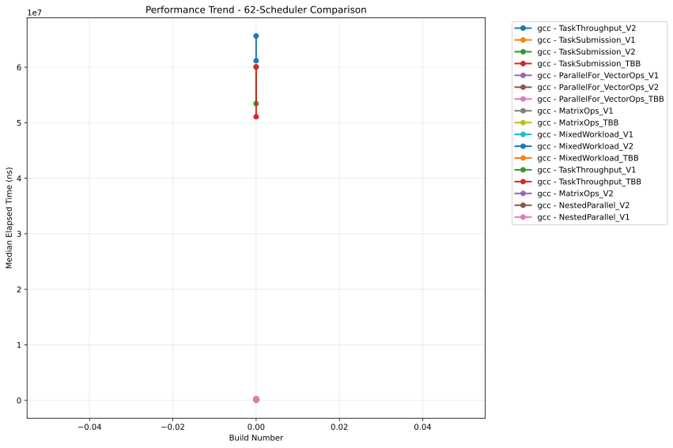
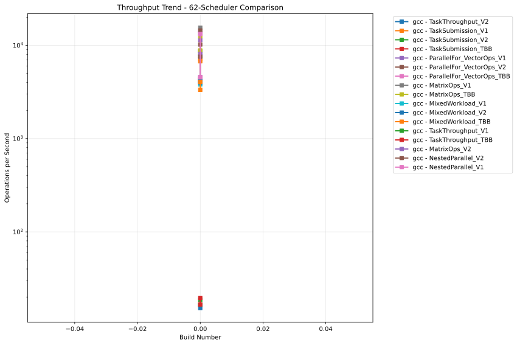

# OULY Performance Tracking

**Generated:** 2025-08-02 02:41:01 UTC

## 📊 Latest Performance Results

**Build Number:** 0
**Commit Hash:** 14.2

### 48-Scheduler Comparison

| Compiler | Benchmark | Median Time (ns) | Ops/sec | Error % |
|----------|-----------|------------------|---------|---------|
| gcc | TaskSubmission_V1 | 141223.30 | 7081 | 0.00 |
| gcc | NestedParallel_V1 | 70608.62 | 14163 | 0.00 |
| gcc | TaskSubmission_V1 | 148722.40 | 6724 | 0.00 |
| gcc | TaskSubmission_V2 | 145771.00 | 6860 | 0.00 |
| gcc | TaskSubmission_TBB | 235868.00 | 4240 | 0.00 |
| gcc | ParallelFor_VectorOps_V1 | 89849.60 | 11130 | 0.00 |
| gcc | ParallelFor_VectorOps_V2 | 93873.10 | 10653 | 0.00 |
| gcc | NestedParallel_V2 | 67269.50 | 14866 | 0.00 |
| gcc | ParallelFor_VectorOps_TBB | 228070.50 | 4385 | 0.00 |
| gcc | MatrixOps_V2 | 70093.70 | 14267 | 0.00 |
| gcc | MatrixOps_TBB | 79524.54 | 12575 | 0.00 |
| gcc | MixedWorkload_V1 | 232265.30 | 4305 | 0.00 |
| gcc | MixedWorkload_V2 | 241679.90 | 4138 | 0.00 |
| gcc | MixedWorkload_TBB | 310070.50 | 3225 | 0.00 |
| gcc | TaskThroughput_V1 | 60806702.50 | 16 | 0.00 |
| gcc | MatrixOps_V1 | 65020.30 | 15380 | 0.00 |
| gcc | TaskThroughput_V2 | 60865093.40 | 16 | 0.00 |
| gcc | TaskThroughput_TBB | 60063484.10 | 17 | 0.00 |
| gcc | TaskThroughput_TBB | 51118287.00 | 20 | 0.00 |
| gcc | TaskSubmission_V2 | 130548.40 | 7660 | 0.00 |
| gcc | TaskSubmission_TBB | 250145.40 | 3998 | 0.00 |
| gcc | ParallelFor_VectorOps_V1 | 220987.00 | 4525 | 0.00 |
| gcc | ParallelFor_VectorOps_V2 | 232234.90 | 4306 | 0.00 |
| gcc | ParallelFor_VectorOps_TBB | 224407.30 | 4456 | 0.00 |
| gcc | NestedParallel_V2 | 127849.30 | 7822 | 0.00 |
| gcc | MatrixOps_V1 | 111586.00 | 8962 | 0.00 |
| gcc | MatrixOps_V2 | 120502.33 | 8299 | 0.00 |
| gcc | MatrixOps_TBB | 113213.10 | 8833 | 0.00 |
| gcc | MixedWorkload_V1 | 381034.30 | 2624 | 0.00 |
| gcc | MixedWorkload_V2 | 249850.80 | 4002 | 0.00 |
| gcc | MixedWorkload_TBB | 241213.70 | 4146 | 0.00 |
| gcc | TaskThroughput_V1 | 52033609.00 | 19 | 0.00 |
| gcc | NestedParallel_V1 | 140882.60 | 7098 | 0.00 |
| gcc | TaskThroughput_V2 | 51272236.20 | 20 | 0.00 |

### 62-Scheduler Comparison

| Compiler | Benchmark | Median Time (ns) | Ops/sec | Error % |
|----------|-----------|------------------|---------|---------|
| gcc | TaskThroughput_V2 | 65630471.60 | 15 | 0.00 |
| gcc | TaskSubmission_V1 | 148205.60 | 6747 | 0.00 |
| gcc | TaskSubmission_V2 | 130246.90 | 7678 | 0.00 |
| gcc | TaskSubmission_TBB | 239367.30 | 4178 | 0.00 |
| gcc | ParallelFor_VectorOps_V1 | 87693.20 | 11403 | 0.00 |
| gcc | ParallelFor_VectorOps_V2 | 97937.40 | 10211 | 0.00 |
| gcc | ParallelFor_VectorOps_TBB | 227935.90 | 4387 | 0.00 |
| gcc | MatrixOps_V1 | 64636.83 | 15471 | 0.00 |
| gcc | MatrixOps_TBB | 80120.00 | 12481 | 0.00 |
| gcc | MixedWorkload_V1 | 236597.10 | 4227 | 0.00 |
| gcc | MixedWorkload_V2 | 241204.80 | 4146 | 0.00 |
| gcc | MixedWorkload_TBB | 299491.00 | 3339 | 0.00 |
| gcc | TaskThroughput_V1 | 60071416.90 | 17 | 0.00 |
| gcc | TaskThroughput_TBB | 60052830.80 | 17 | 0.00 |
| gcc | MatrixOps_V2 | 73274.20 | 13647 | 0.00 |
| gcc | NestedParallel_V2 | 69299.70 | 14430 | 0.00 |
| gcc | NestedParallel_V1 | 75568.50 | 13233 | 0.00 |
| gcc | NestedParallel_V1 | 219580.00 | 4554 | 0.00 |
| gcc | TaskSubmission_V1 | 140495.00 | 7118 | 0.00 |
| gcc | TaskSubmission_V2 | 114670.88 | 8721 | 0.00 |
| gcc | TaskSubmission_TBB | 247688.70 | 4037 | 0.00 |
| gcc | ParallelFor_VectorOps_V1 | 219098.20 | 4564 | 0.00 |
| gcc | ParallelFor_VectorOps_V2 | 227860.50 | 4389 | 0.00 |
| gcc | ParallelFor_VectorOps_TBB | 223562.50 | 4473 | 0.00 |
| gcc | MatrixOps_V1 | 115495.20 | 8658 | 0.00 |
| gcc | MatrixOps_V2 | 123884.90 | 8072 | 0.00 |
| gcc | MixedWorkload_V1 | 262842.10 | 3805 | 0.00 |
| gcc | MixedWorkload_V2 | 249354.80 | 4010 | 0.00 |
| gcc | MixedWorkload_TBB | 246415.20 | 4058 | 0.00 |
| gcc | TaskThroughput_V1 | 53450293.60 | 19 | 0.00 |
| gcc | TaskThroughput_V2 | 61162691.60 | 16 | 0.00 |
| gcc | TaskThroughput_TBB | 51080393.70 | 20 | 0.00 |
| gcc | MatrixOps_TBB | 113442.44 | 8815 | 0.00 |
| gcc | NestedParallel_V2 | 132316.29 | 7558 | 0.00 |

## 📈 Performance Trends

### 48-Scheduler Comparison - Execution Time

### 48-Scheduler Comparison - Throughput

### 62-Scheduler Comparison - Execution Time

### 62-Scheduler Comparison - Throughput

## 📋 Data Summary

- **Total benchmark runs:** 68
- **Build range:** 0 - 0
- **Date range:** 2025-08-02 to 2025-08-02
- **Compilers tested:** gcc
- **Test categories:** 48-scheduler_comparison, 62-scheduler_comparison

---
*This report is automatically generated from benchmark results stored in the perfo branch.*