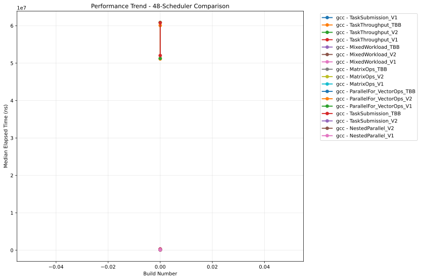
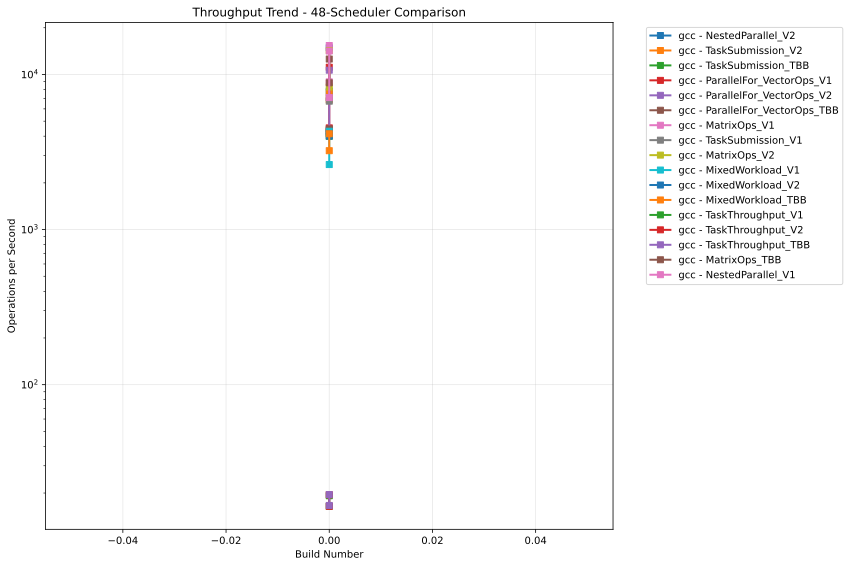
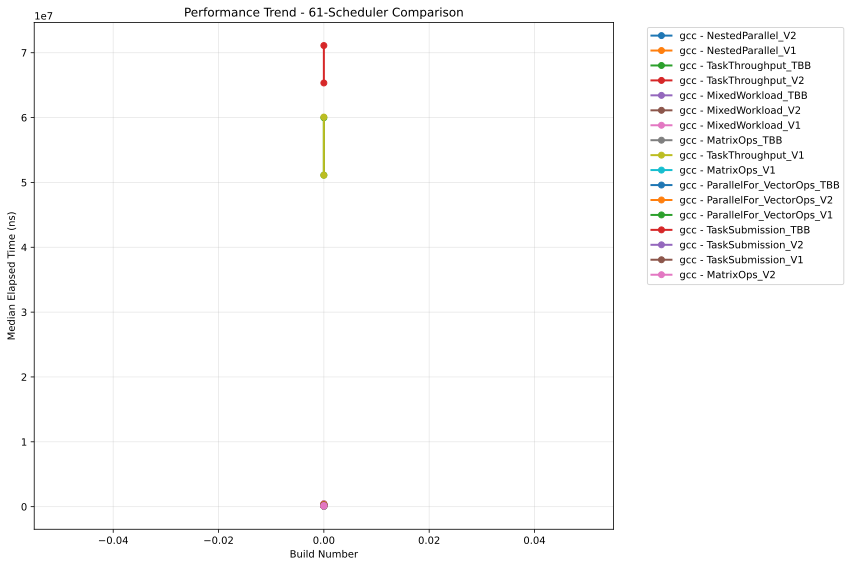
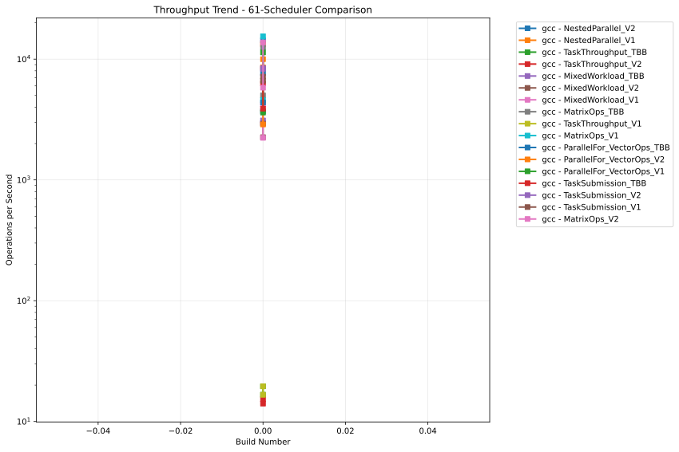

# OULY Performance Tracking

**Generated:** 2025-08-01 18:49:14 UTC

## 📊 Latest Performance Results

**Build Number:** 0
**Commit Hash:** 14.2

### 48-Scheduler Comparison

| Compiler | Benchmark | Median Time (ns) | Ops/sec | Error % |
|----------|-----------|------------------|---------|---------|
| gcc | NestedParallel_V2 | 127849.30 | 7822 | 0.00 |
| gcc | MixedWorkload_V2 | 249850.80 | 4002 | 0.00 |
| gcc | MixedWorkload_TBB | 241213.70 | 4146 | 0.00 |
| gcc | TaskThroughput_V1 | 52033609.00 | 19 | 0.00 |
| gcc | TaskThroughput_V2 | 51272236.20 | 20 | 0.00 |
| gcc | TaskThroughput_TBB | 51118287.00 | 20 | 0.00 |
| gcc | NestedParallel_V1 | 140882.60 | 7098 | 0.00 |
| gcc | NestedParallel_V1 | 70608.62 | 14163 | 0.00 |
| gcc | TaskSubmission_V1 | 148722.40 | 6724 | 0.00 |
| gcc | TaskSubmission_V2 | 145771.00 | 6860 | 0.00 |
| gcc | TaskSubmission_TBB | 235868.00 | 4240 | 0.00 |
| gcc | MixedWorkload_V1 | 381034.30 | 2624 | 0.00 |
| gcc | ParallelFor_VectorOps_V1 | 89849.60 | 11130 | 0.00 |
| gcc | ParallelFor_VectorOps_TBB | 228070.50 | 4385 | 0.00 |
| gcc | MatrixOps_V1 | 65020.30 | 15380 | 0.00 |
| gcc | MatrixOps_V2 | 70093.70 | 14267 | 0.00 |
| gcc | MatrixOps_TBB | 79524.54 | 12575 | 0.00 |
| gcc | MixedWorkload_V1 | 232265.30 | 4305 | 0.00 |
| gcc | MixedWorkload_V2 | 241679.90 | 4138 | 0.00 |
| gcc | MixedWorkload_TBB | 310070.50 | 3225 | 0.00 |
| gcc | TaskThroughput_V1 | 60806702.50 | 16 | 0.00 |
| gcc | TaskThroughput_V2 | 60865093.40 | 16 | 0.00 |
| gcc | TaskThroughput_TBB | 60063484.10 | 17 | 0.00 |
| gcc | ParallelFor_VectorOps_V2 | 93873.10 | 10653 | 0.00 |
| gcc | MatrixOps_TBB | 113213.10 | 8833 | 0.00 |
| gcc | NestedParallel_V2 | 67269.50 | 14866 | 0.00 |
| gcc | MatrixOps_V1 | 111586.00 | 8962 | 0.00 |
| gcc | ParallelFor_VectorOps_TBB | 224407.30 | 4456 | 0.00 |
| gcc | ParallelFor_VectorOps_V2 | 232234.90 | 4306 | 0.00 |
| gcc | ParallelFor_VectorOps_V1 | 220987.00 | 4525 | 0.00 |
| gcc | TaskSubmission_TBB | 250145.40 | 3998 | 0.00 |
| gcc | TaskSubmission_V2 | 130548.40 | 7660 | 0.00 |
| gcc | TaskSubmission_V1 | 141223.30 | 7081 | 0.00 |
| gcc | MatrixOps_V2 | 120502.33 | 8299 | 0.00 |

### 61-Scheduler Comparison

| Compiler | Benchmark | Median Time (ns) | Ops/sec | Error % |
|----------|-----------|------------------|---------|---------|
| gcc | NestedParallel_V2 | 69853.90 | 14316 | 0.00 |
| gcc | NestedParallel_V1 | 75224.80 | 13293 | 0.00 |
| gcc | TaskThroughput_TBB | 59980101.70 | 17 | 0.00 |
| gcc | TaskThroughput_V2 | 71107549.20 | 14 | 0.00 |
| gcc | MixedWorkload_TBB | 337441.40 | 2963 | 0.00 |
| gcc | MixedWorkload_V2 | 341940.90 | 2924 | 0.00 |
| gcc | MixedWorkload_V1 | 237685.90 | 4207 | 0.00 |
| gcc | MatrixOps_TBB | 80128.00 | 12480 | 0.00 |
| gcc | TaskThroughput_V1 | 60077083.70 | 17 | 0.00 |
| gcc | MatrixOps_V1 | 64647.20 | 15469 | 0.00 |
| gcc | ParallelFor_VectorOps_TBB | 228610.00 | 4374 | 0.00 |
| gcc | ParallelFor_VectorOps_V2 | 100042.10 | 9996 | 0.00 |
| gcc | ParallelFor_VectorOps_V1 | 88050.70 | 11357 | 0.00 |
| gcc | TaskSubmission_TBB | 158603.90 | 6305 | 0.00 |
| gcc | TaskSubmission_V2 | 118540.44 | 8436 | 0.00 |
| gcc | TaskSubmission_V1 | 150685.20 | 6636 | 0.00 |
| gcc | MatrixOps_V2 | 72678.10 | 13759 | 0.00 |
| gcc | TaskSubmission_V2 | 120218.10 | 8318 | 0.00 |
| gcc | TaskSubmission_TBB | 257185.40 | 3888 | 0.00 |
| gcc | ParallelFor_VectorOps_V1 | 276805.00 | 3613 | 0.00 |
| gcc | ParallelFor_VectorOps_V2 | 347452.60 | 2878 | 0.00 |
| gcc | ParallelFor_VectorOps_TBB | 269572.40 | 3710 | 0.00 |
| gcc | MatrixOps_V1 | 218212.80 | 4583 | 0.00 |
| gcc | MatrixOps_V2 | 172346.30 | 5802 | 0.00 |
| gcc | MixedWorkload_TBB | 321948.10 | 3106 | 0.00 |
| gcc | MixedWorkload_V1 | 448156.30 | 2231 | 0.00 |
| gcc | MixedWorkload_V2 | 442876.50 | 2258 | 0.00 |
| gcc | TaskThroughput_V1 | 51106090.60 | 20 | 0.00 |
| gcc | TaskThroughput_V2 | 65333744.20 | 15 | 0.00 |
| gcc | TaskThroughput_TBB | 51126280.20 | 20 | 0.00 |
| gcc | NestedParallel_V1 | 117035.20 | 8544 | 0.00 |
| gcc | NestedParallel_V2 | 130429.10 | 7667 | 0.00 |
| gcc | MatrixOps_TBB | 199700.30 | 5008 | 0.00 |
| gcc | TaskSubmission_V1 | 139699.40 | 7158 | 0.00 |

## 📈 Performance Trends

### 48-Scheduler Comparison - Execution Time

### 48-Scheduler Comparison - Throughput

### 61-Scheduler Comparison - Execution Time

### 61-Scheduler Comparison - Throughput

## 📋 Data Summary

- **Total benchmark runs:** 68
- **Build range:** 0 - 0
- **Date range:** 2025-08-01 to 2025-08-01
- **Compilers tested:** gcc
- **Test categories:** 48-scheduler_comparison, 61-scheduler_comparison

---
*This report is automatically generated from benchmark results stored in the perfo branch.*