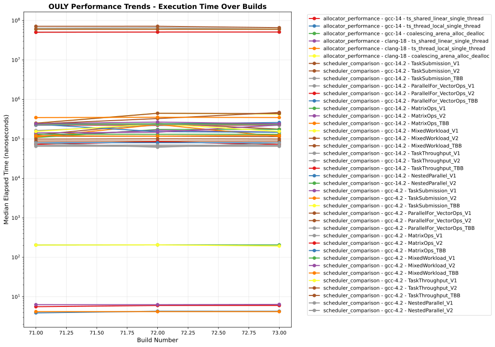
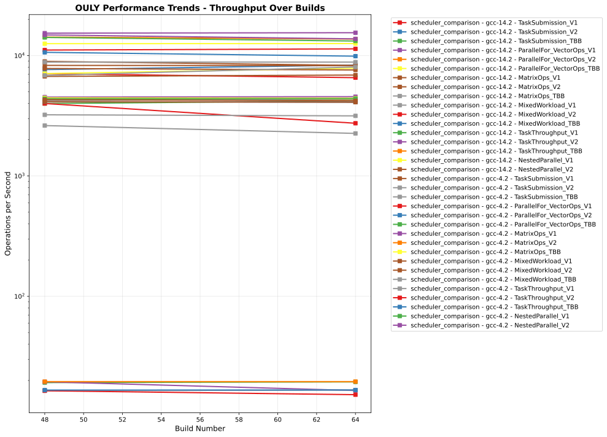
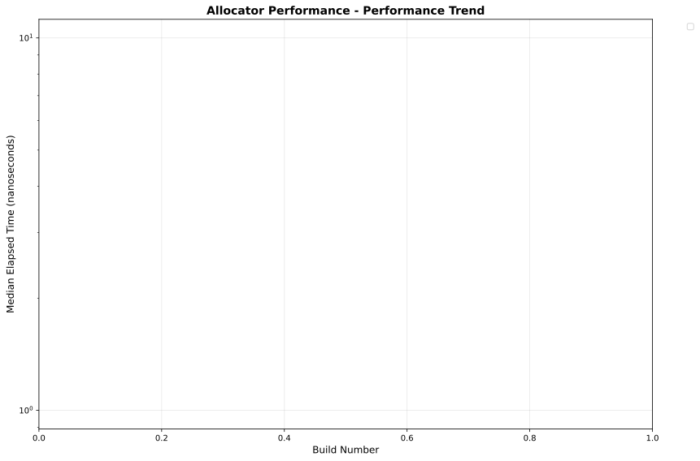
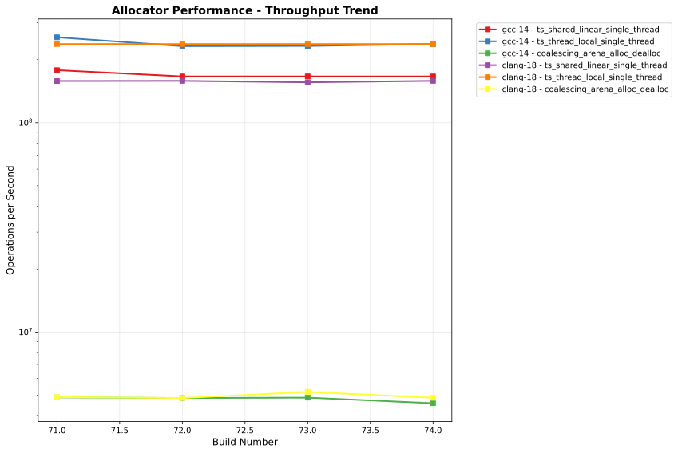
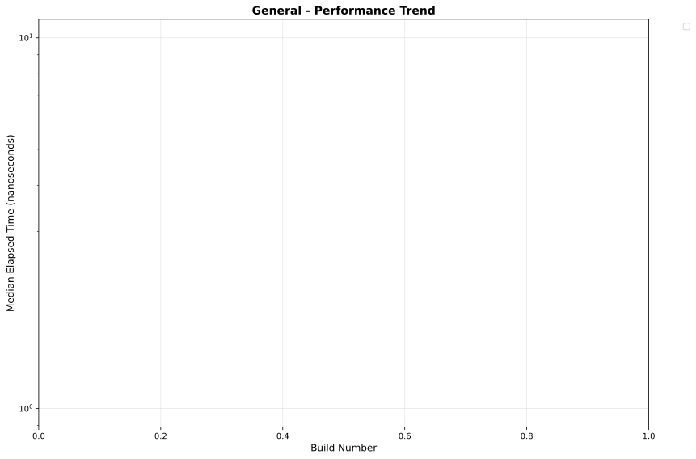
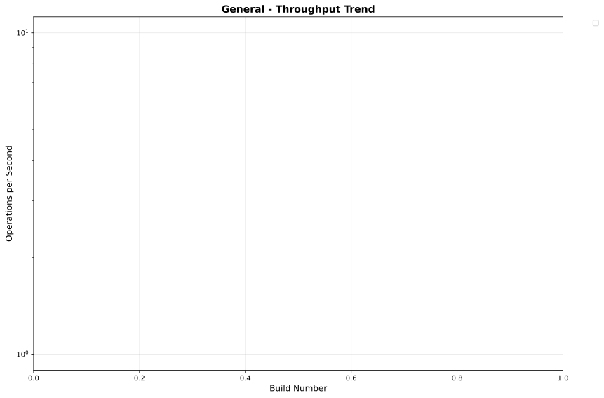
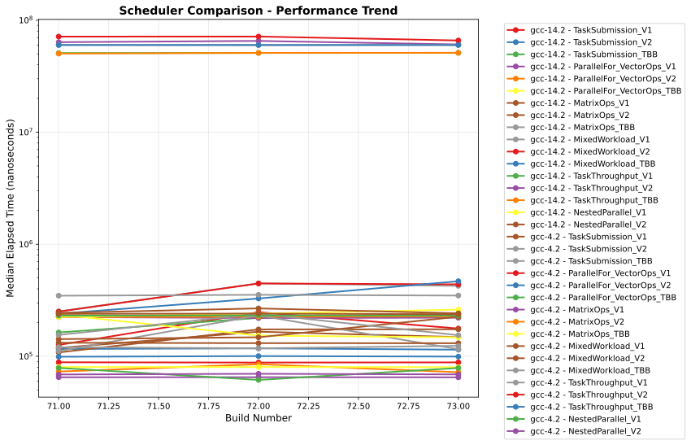
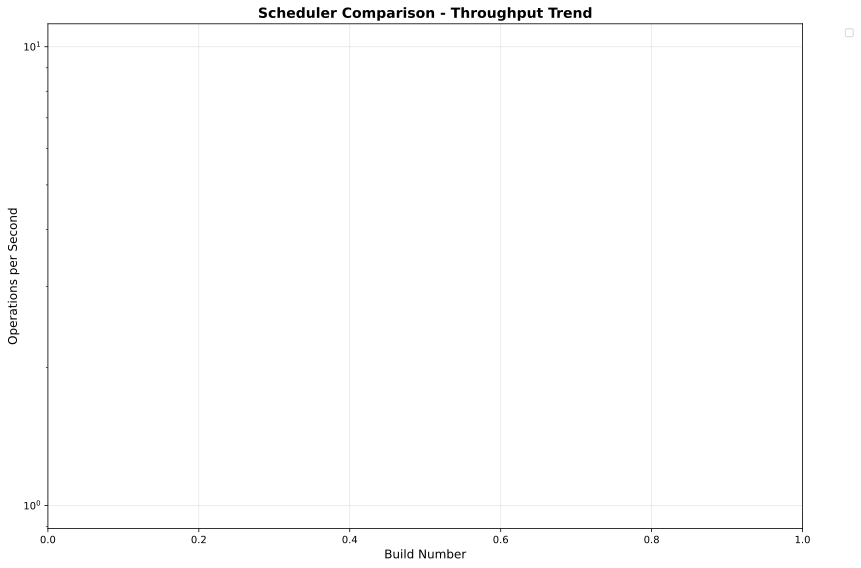

# OULY Performance Tracking

**Generated:** 2025-08-02 05:11:05 UTC

## 📊 Latest Performance Results

**Build Number:** 64
**Commit Hash:** dc078f15

### Scheduler Comparison

| Compiler | Benchmark | Median Time (ns) | Ops/sec | Error % |
|----------|-----------|------------------|---------|---------|
| gcc-14.2 | TaskSubmission_V1 | 152390.50 | 6562 | 0.00 |
| gcc-14.2 | TaskSubmission_V2 | 119910.60 | 8340 | 0.00 |
| gcc-14.2 | TaskSubmission_TBB | 237298.50 | 4214 | 0.00 |
| gcc-14.2 | ParallelFor_VectorOps_V1 | 219321.80 | 4560 | 0.00 |
| gcc-14.2 | ParallelFor_VectorOps_V2 | 230224.20 | 4344 | 0.00 |
| gcc-14.2 | ParallelFor_VectorOps_TBB | 225712.80 | 4430 | 0.00 |
| gcc-14.2 | MatrixOps_V1 | 120680.29 | 8286 | 0.00 |
| gcc-14.2 | MatrixOps_V2 | 120983.60 | 8266 | 0.00 |
| gcc-14.2 | MatrixOps_TBB | 113148.90 | 8838 | 0.00 |
| gcc-14.2 | MixedWorkload_V1 | 442743.30 | 2259 | 0.00 |
| gcc-14.2 | MixedWorkload_V2 | 364519.80 | 2743 | 0.00 |
| gcc-14.2 | MixedWorkload_TBB | 243500.10 | 4107 | 0.00 |
| gcc-14.2 | TaskThroughput_V1 | 51359035.90 | 19 | 0.00 |
| gcc-14.2 | TaskThroughput_V2 | 60581470.50 | 17 | 0.00 |
| gcc-14.2 | TaskThroughput_TBB | 51091302.60 | 20 | 0.00 |
| gcc-14.2 | NestedParallel_V1 | 127032.90 | 7872 | 0.00 |
| gcc-14.2 | NestedParallel_V2 | 131507.30 | 7604 | 0.00 |
| gcc-4.2 | TaskSubmission_V1 | 144964.10 | 6898 | 0.00 |
| gcc-4.2 | TaskSubmission_V2 | 124264.20 | 8047 | 0.00 |
| gcc-4.2 | TaskSubmission_TBB | 229336.40 | 4360 | 0.00 |
| gcc-4.2 | ParallelFor_VectorOps_V1 | 87819.80 | 11387 | 0.00 |
| gcc-4.2 | ParallelFor_VectorOps_V2 | 100993.50 | 9902 | 0.00 |
| gcc-4.2 | ParallelFor_VectorOps_TBB | 227862.60 | 4389 | 0.00 |
| gcc-4.2 | MatrixOps_V1 | 64486.00 | 15507 | 0.00 |
| gcc-4.2 | MatrixOps_V2 | 72777.60 | 13740 | 0.00 |
| gcc-4.2 | MatrixOps_TBB | 79393.00 | 12596 | 0.00 |
| gcc-4.2 | MixedWorkload_V1 | 237207.10 | 4216 | 0.00 |
| gcc-4.2 | MixedWorkload_V2 | 243686.30 | 4104 | 0.00 |
| gcc-4.2 | MixedWorkload_TBB | 316472.90 | 3160 | 0.00 |
| gcc-4.2 | TaskThroughput_V1 | 60040795.40 | 17 | 0.00 |
| gcc-4.2 | TaskThroughput_V2 | 65604208.50 | 15 | 0.00 |
| gcc-4.2 | TaskThroughput_TBB | 59964033.80 | 17 | 0.00 |
| gcc-4.2 | NestedParallel_V1 | 75595.90 | 13228 | 0.00 |
| gcc-4.2 | NestedParallel_V2 | 72562.20 | 13781 | 0.00 |

### Allocator Performance

| Compiler | Benchmark | Median Time (ns) | Ops/sec | Error % |
|----------|-----------|------------------|---------|---------|
| clang-18 | ts_shared_linear_single_thread | 6.31 | 158478605 | 0.00 |
| clang-18 | ts_thread_local_single_thread | 4.21 | 237529691 | 0.00 |
| clang-18 | coalescing_arena_alloc_dealloc | 217.51 | 4597490 | 0.00 |
| gcc-14 | ts_shared_linear_single_thread | 6.11 | 163666121 | 0.00 |
| gcc-14 | ts_thread_local_single_thread | 4.30 | 232558140 | 0.00 |
| gcc-14 | coalescing_arena_alloc_dealloc | 206.99 | 4831151 | 0.00 |

## 📈 Performance Trends

The following charts show performance trends over build numbers, 
with build number on the X-axis and performance metrics on the Y-axis.

### Overall Performance Trends

#### Execution Time Trends

#### Throughput Trends

### Allocator Performance Performance Details

#### Execution Time

#### Throughput

### General Performance Details

#### Execution Time

#### Throughput

### Scheduler Comparison Performance Details

#### Execution Time

#### Throughput

## 📋 Data Summary

- **Total benchmark runs:** 77
- **Build range:** 0 - 64
- **Date range:** 2025-08-02 to 2025-08-02
- **Compilers tested:** unknown, gcc-14.2, gcc-4.2, clang-18, gcc-14
- **Test categories:** general, scheduler_comparison, allocator_performance

---
*This report is automatically generated from benchmark results stored in the perfo branch.*