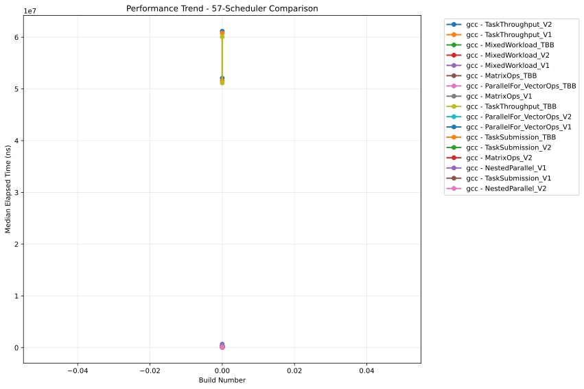
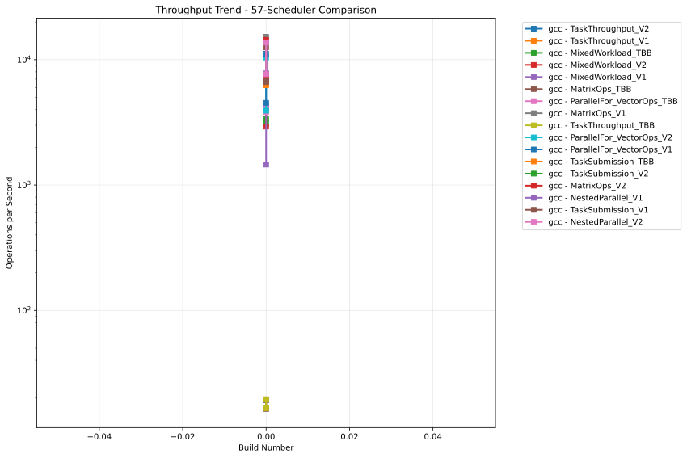

# OULY Performance Tracking

**Generated:** 2025-08-01 03:08:13 UTC

## 📊 Latest Performance Results

**Build Number:** 0
**Commit Hash:** 14.2

### 48-Scheduler Comparison

| Compiler | Benchmark | Median Time (ns) | Ops/sec | Error % |
|----------|-----------|------------------|---------|---------|
| gcc | NestedParallel_V2 | 127849.30 | 7822 | 0.00 |
| gcc | MixedWorkload_V2 | 249850.80 | 4002 | 0.00 |
| gcc | MixedWorkload_TBB | 241213.70 | 4146 | 0.00 |
| gcc | TaskThroughput_V1 | 52033609.00 | 19 | 0.00 |
| gcc | TaskThroughput_V2 | 51272236.20 | 20 | 0.00 |
| gcc | TaskThroughput_TBB | 51118287.00 | 20 | 0.00 |
| gcc | NestedParallel_V1 | 140882.60 | 7098 | 0.00 |
| gcc | NestedParallel_V1 | 70608.62 | 14163 | 0.00 |
| gcc | TaskSubmission_V1 | 148722.40 | 6724 | 0.00 |
| gcc | TaskSubmission_V2 | 145771.00 | 6860 | 0.00 |
| gcc | TaskSubmission_TBB | 235868.00 | 4240 | 0.00 |
| gcc | MixedWorkload_V1 | 381034.30 | 2624 | 0.00 |
| gcc | ParallelFor_VectorOps_V1 | 89849.60 | 11130 | 0.00 |
| gcc | ParallelFor_VectorOps_TBB | 228070.50 | 4385 | 0.00 |
| gcc | MatrixOps_V1 | 65020.30 | 15380 | 0.00 |
| gcc | MatrixOps_V2 | 70093.70 | 14267 | 0.00 |
| gcc | MatrixOps_TBB | 79524.54 | 12575 | 0.00 |
| gcc | MixedWorkload_V1 | 232265.30 | 4305 | 0.00 |
| gcc | MixedWorkload_V2 | 241679.90 | 4138 | 0.00 |
| gcc | MixedWorkload_TBB | 310070.50 | 3225 | 0.00 |
| gcc | TaskThroughput_V1 | 60806702.50 | 16 | 0.00 |
| gcc | TaskThroughput_V2 | 60865093.40 | 16 | 0.00 |
| gcc | TaskThroughput_TBB | 60063484.10 | 17 | 0.00 |
| gcc | ParallelFor_VectorOps_V2 | 93873.10 | 10653 | 0.00 |
| gcc | MatrixOps_TBB | 113213.10 | 8833 | 0.00 |
| gcc | NestedParallel_V2 | 67269.50 | 14866 | 0.00 |
| gcc | MatrixOps_V1 | 111586.00 | 8962 | 0.00 |
| gcc | ParallelFor_VectorOps_TBB | 224407.30 | 4456 | 0.00 |
| gcc | ParallelFor_VectorOps_V2 | 232234.90 | 4306 | 0.00 |
| gcc | ParallelFor_VectorOps_V1 | 220987.00 | 4525 | 0.00 |
| gcc | TaskSubmission_TBB | 250145.40 | 3998 | 0.00 |
| gcc | TaskSubmission_V2 | 130548.40 | 7660 | 0.00 |
| gcc | TaskSubmission_V1 | 141223.30 | 7081 | 0.00 |
| gcc | MatrixOps_V2 | 120502.33 | 8299 | 0.00 |

### 57-Scheduler Comparison

| Compiler | Benchmark | Median Time (ns) | Ops/sec | Error % |
|----------|-----------|------------------|---------|---------|
| gcc | TaskThroughput_V2 | 61146780.70 | 16 | 0.00 |
| gcc | TaskThroughput_V1 | 60758625.70 | 16 | 0.00 |
| gcc | MixedWorkload_TBB | 297477.70 | 3362 | 0.00 |
| gcc | MixedWorkload_V2 | 242519.40 | 4123 | 0.00 |
| gcc | MixedWorkload_V1 | 235217.80 | 4251 | 0.00 |
| gcc | MatrixOps_TBB | 79826.60 | 12527 | 0.00 |
| gcc | ParallelFor_VectorOps_TBB | 231071.10 | 4328 | 0.00 |
| gcc | MatrixOps_V1 | 65605.00 | 15243 | 0.00 |
| gcc | TaskThroughput_TBB | 60059365.80 | 17 | 0.00 |
| gcc | ParallelFor_VectorOps_V2 | 96205.10 | 10394 | 0.00 |
| gcc | ParallelFor_VectorOps_V1 | 89709.00 | 11147 | 0.00 |
| gcc | TaskSubmission_TBB | 159829.60 | 6257 | 0.00 |
| gcc | TaskSubmission_V2 | 145134.57 | 6890 | 0.00 |
| gcc | MatrixOps_V2 | 69487.30 | 14391 | 0.00 |
| gcc | NestedParallel_V1 | 72945.70 | 13709 | 0.00 |
| gcc | TaskSubmission_V1 | 148752.90 | 6723 | 0.00 |
| gcc | NestedParallel_V2 | 72780.40 | 13740 | 0.00 |
| gcc | NestedParallel_V2 | 130508.90 | 7662 | 0.00 |
| gcc | TaskSubmission_V1 | 151076.20 | 6619 | 0.00 |
| gcc | TaskSubmission_V2 | 139528.70 | 7167 | 0.00 |
| gcc | TaskSubmission_TBB | 158153.30 | 6323 | 0.00 |
| gcc | ParallelFor_VectorOps_V1 | 220866.10 | 4528 | 0.00 |
| gcc | ParallelFor_VectorOps_V2 | 254965.50 | 3922 | 0.00 |
| gcc | ParallelFor_VectorOps_TBB | 261672.00 | 3822 | 0.00 |
| gcc | MatrixOps_V1 | 128670.50 | 7772 | 0.00 |
| gcc | MatrixOps_V2 | 142761.60 | 7005 | 0.00 |
| gcc | MatrixOps_TBB | 140215.90 | 7132 | 0.00 |
| gcc | MixedWorkload_V1 | 687328.10 | 1455 | 0.00 |
| gcc | MixedWorkload_V2 | 341625.80 | 2927 | 0.00 |
| gcc | MixedWorkload_TBB | 320715.80 | 3118 | 0.00 |
| gcc | TaskThroughput_V2 | 52080296.80 | 19 | 0.00 |
| gcc | TaskThroughput_TBB | 51141524.60 | 20 | 0.00 |
| gcc | NestedParallel_V1 | 129110.30 | 7745 | 0.00 |
| gcc | TaskThroughput_V1 | 51589164.80 | 19 | 0.00 |

## 📈 Performance Trends

### 48-Scheduler Comparison - Execution Time

### 48-Scheduler Comparison - Throughput

### 57-Scheduler Comparison - Execution Time

### 57-Scheduler Comparison - Throughput

## 📋 Data Summary

- **Total benchmark runs:** 68
- **Build range:** 0 - 0
- **Date range:** 2025-08-01 to 2025-08-01
- **Compilers tested:** gcc
- **Test categories:** 48-scheduler_comparison, 57-scheduler_comparison

---
*This report is automatically generated from benchmark results stored in the perfo branch.*