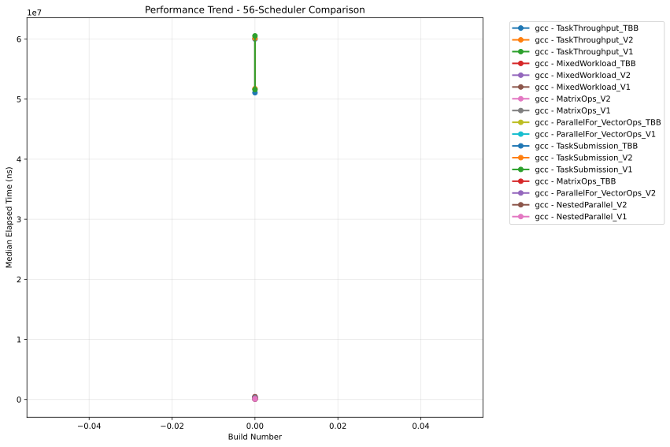
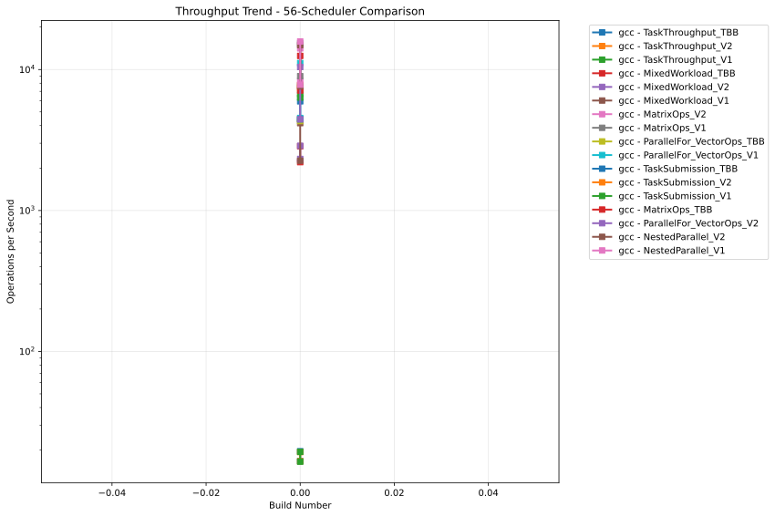

# OULY Performance Tracking

**Generated:** 2025-08-01 03:06:30 UTC

## 📊 Latest Performance Results

**Build Number:** 0
**Commit Hash:** 14.2

### 48-Scheduler Comparison

| Compiler | Benchmark | Median Time (ns) | Ops/sec | Error % |
|----------|-----------|------------------|---------|---------|
| gcc | NestedParallel_V2 | 127849.30 | 7822 | 0.00 |
| gcc | MixedWorkload_V1 | 381034.30 | 2624 | 0.00 |
| gcc | MixedWorkload_V2 | 249850.80 | 4002 | 0.00 |
| gcc | MixedWorkload_TBB | 241213.70 | 4146 | 0.00 |
| gcc | TaskThroughput_V1 | 52033609.00 | 19 | 0.00 |
| gcc | TaskThroughput_V2 | 51272236.20 | 20 | 0.00 |
| gcc | TaskThroughput_TBB | 51118287.00 | 20 | 0.00 |
| gcc | NestedParallel_V1 | 140882.60 | 7098 | 0.00 |
| gcc | NestedParallel_V1 | 70608.62 | 14163 | 0.00 |
| gcc | TaskSubmission_V1 | 148722.40 | 6724 | 0.00 |
| gcc | TaskSubmission_V2 | 145771.00 | 6860 | 0.00 |
| gcc | TaskSubmission_TBB | 235868.00 | 4240 | 0.00 |
| gcc | ParallelFor_VectorOps_V1 | 89849.60 | 11130 | 0.00 |
| gcc | ParallelFor_VectorOps_V2 | 93873.10 | 10653 | 0.00 |
| gcc | ParallelFor_VectorOps_TBB | 228070.50 | 4385 | 0.00 |
| gcc | MatrixOps_V1 | 65020.30 | 15380 | 0.00 |
| gcc | MatrixOps_V2 | 70093.70 | 14267 | 0.00 |
| gcc | MatrixOps_TBB | 79524.54 | 12575 | 0.00 |
| gcc | MixedWorkload_V1 | 232265.30 | 4305 | 0.00 |
| gcc | MixedWorkload_V2 | 241679.90 | 4138 | 0.00 |
| gcc | MixedWorkload_TBB | 310070.50 | 3225 | 0.00 |
| gcc | TaskThroughput_V1 | 60806702.50 | 16 | 0.00 |
| gcc | MatrixOps_TBB | 113213.10 | 8833 | 0.00 |
| gcc | TaskThroughput_V2 | 60865093.40 | 16 | 0.00 |
| gcc | MatrixOps_V2 | 120502.33 | 8299 | 0.00 |
| gcc | ParallelFor_VectorOps_TBB | 224407.30 | 4456 | 0.00 |
| gcc | MatrixOps_V1 | 111586.00 | 8962 | 0.00 |
| gcc | NestedParallel_V2 | 67269.50 | 14866 | 0.00 |
| gcc | TaskSubmission_V1 | 141223.30 | 7081 | 0.00 |
| gcc | TaskThroughput_TBB | 60063484.10 | 17 | 0.00 |
| gcc | TaskSubmission_TBB | 250145.40 | 3998 | 0.00 |
| gcc | ParallelFor_VectorOps_V1 | 220987.00 | 4525 | 0.00 |
| gcc | ParallelFor_VectorOps_V2 | 232234.90 | 4306 | 0.00 |
| gcc | TaskSubmission_V2 | 130548.40 | 7660 | 0.00 |

### 56-Scheduler Comparison

| Compiler | Benchmark | Median Time (ns) | Ops/sec | Error % |
|----------|-----------|------------------|---------|---------|
| gcc | TaskThroughput_TBB | 60005759.50 | 17 | 0.00 |
| gcc | TaskThroughput_V2 | 60123192.30 | 17 | 0.00 |
| gcc | TaskThroughput_V1 | 60521190.00 | 17 | 0.00 |
| gcc | MixedWorkload_TBB | 350018.10 | 2857 | 0.00 |
| gcc | MixedWorkload_V2 | 430819.00 | 2321 | 0.00 |
| gcc | MixedWorkload_V1 | 240027.20 | 4166 | 0.00 |
| gcc | MatrixOps_V2 | 70757.00 | 14133 | 0.00 |
| gcc | MatrixOps_V1 | 65233.70 | 15329 | 0.00 |
| gcc | ParallelFor_VectorOps_TBB | 232048.20 | 4309 | 0.00 |
| gcc | ParallelFor_VectorOps_V1 | 90031.30 | 11107 | 0.00 |
| gcc | TaskSubmission_TBB | 168118.00 | 5948 | 0.00 |
| gcc | TaskSubmission_V2 | 135410.29 | 7385 | 0.00 |
| gcc | TaskSubmission_V1 | 158154.30 | 6323 | 0.00 |
| gcc | MatrixOps_TBB | 80003.40 | 12499 | 0.00 |
| gcc | ParallelFor_VectorOps_V2 | 96016.60 | 10415 | 0.00 |
| gcc | NestedParallel_V2 | 67175.30 | 14886 | 0.00 |
| gcc | NestedParallel_V1 | 63221.90 | 15817 | 0.00 |
| gcc | NestedParallel_V2 | 131845.30 | 7585 | 0.00 |
| gcc | TaskSubmission_V2 | 129147.38 | 7743 | 0.00 |
| gcc | TaskSubmission_TBB | 225464.10 | 4435 | 0.00 |
| gcc | ParallelFor_VectorOps_V1 | 220677.10 | 4532 | 0.00 |
| gcc | ParallelFor_VectorOps_V2 | 225542.30 | 4434 | 0.00 |
| gcc | ParallelFor_VectorOps_TBB | 224520.30 | 4454 | 0.00 |
| gcc | MatrixOps_V1 | 111471.20 | 8971 | 0.00 |
| gcc | MatrixOps_V2 | 119806.70 | 8347 | 0.00 |
| gcc | MatrixOps_TBB | 140933.30 | 7096 | 0.00 |
| gcc | MixedWorkload_V2 | 347696.30 | 2876 | 0.00 |
| gcc | MixedWorkload_TBB | 454177.30 | 2202 | 0.00 |
| gcc | TaskThroughput_V1 | 51583139.70 | 19 | 0.00 |
| gcc | TaskThroughput_V2 | 51733787.10 | 19 | 0.00 |
| gcc | TaskThroughput_TBB | 51064809.90 | 20 | 0.00 |
| gcc | NestedParallel_V1 | 128164.40 | 7802 | 0.00 |
| gcc | MixedWorkload_V1 | 443492.50 | 2255 | 0.00 |
| gcc | TaskSubmission_V1 | 150367.90 | 6650 | 0.00 |

## 📈 Performance Trends

### 48-Scheduler Comparison - Execution Time

### 48-Scheduler Comparison - Throughput

### 56-Scheduler Comparison - Execution Time

### 56-Scheduler Comparison - Throughput

## 📋 Data Summary

- **Total benchmark runs:** 68
- **Build range:** 0 - 0
- **Date range:** 2025-08-01 to 2025-08-01
- **Compilers tested:** gcc
- **Test categories:** 48-scheduler_comparison, 56-scheduler_comparison

---
*This report is automatically generated from benchmark results stored in the perfo branch.*