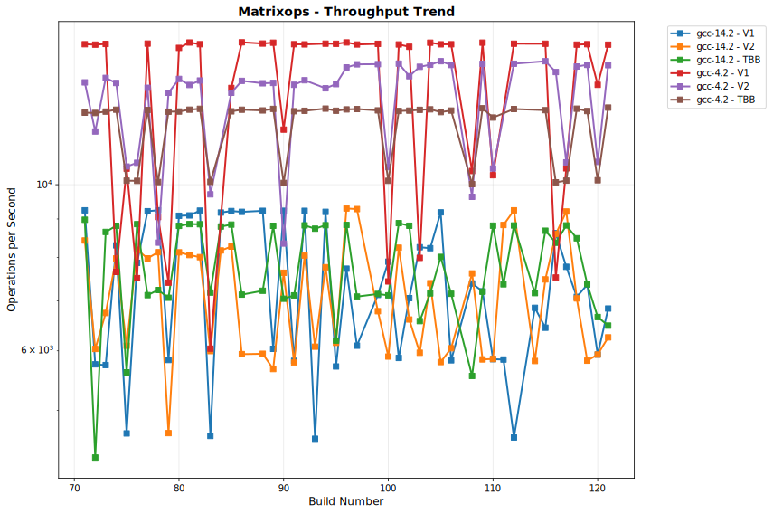

# OULY Performance Tracking

**Generated:** 2025-08-12 17:25:59 UTC

## 📊 Latest Performance Results

**Build Number:** 83
**Commit Hash:** 17f0e13b

### Allocator Performance

| Compiler | Benchmark | Median Time (ns) | Ops/sec | Error % |
|----------|-----------|------------------|---------|---------|
| clang-18 | ts_shared_linear_single_thread | 6.31 | 158478605 | 0.00 |
| clang-18 | ts_thread_local_single_thread | 4.21 | 237529691 | 0.00 |
| clang-18 | coalescing_arena_alloc_dealloc | 204.49 | 4890215 | 0.00 |
| gcc-14 | ts_shared_linear_single_thread | 6.11 | 163666121 | 0.00 |
| gcc-14 | ts_thread_local_single_thread | 4.31 | 232018561 | 0.00 |
| gcc-14 | coalescing_arena_alloc_dealloc | 220.42 | 4536793 | 0.00 |

### Scheduler Comparison

| Compiler | Benchmark | Median Time (ns) | Ops/sec | Error % |
|----------|-----------|------------------|---------|---------|
| gcc-14.2 | TaskSubmission_V1 | 127297.17 | 7856 | 0.00 |
| gcc-14.2 | TaskSubmission_V2 | 122009.50 | 8196 | 0.00 |
| gcc-14.2 | TaskSubmission_TBB | 187188.00 | 5342 | 0.00 |
| gcc-14.2 | ParallelFor_VectorOps_V1 | 442628.10 | 2259 | 0.00 |
| gcc-14.2 | ParallelFor_VectorOps_V2 | 272638.30 | 3668 | 0.00 |
| gcc-14.2 | ParallelFor_VectorOps_TBB | 258031.00 | 3876 | 0.00 |
| gcc-14.2 | MatrixOps_V1 | 216409.40 | 4621 | 0.00 |
| gcc-14.2 | MatrixOps_V2 | 166759.90 | 5997 | 0.00 |
| gcc-14.2 | MatrixOps_TBB | 139312.57 | 7178 | 0.00 |
| gcc-14.2 | MixedWorkload_V1 | 268551.60 | 3724 | 0.00 |
| gcc-14.2 | MixedWorkload_V2 | 252631.00 | 3958 | 0.00 |
| gcc-14.2 | MixedWorkload_TBB | 241801.80 | 4136 | 0.00 |
| gcc-14.2 | TaskThroughput_V1 | 51062954.50 | 20 | 0.00 |
| gcc-14.2 | TaskThroughput_V2 | 60762765.20 | 16 | 0.00 |
| gcc-14.2 | TaskThroughput_TBB | 51092912.20 | 20 | 0.00 |
| gcc-14.2 | NestedParallel_V1 | 234320.70 | 4268 | 0.00 |
| gcc-14.2 | NestedParallel_V2 | 128971.90 | 7754 | 0.00 |
| gcc-4.2 | TaskSubmission_V1 | 141023.90 | 7091 | 0.00 |
| gcc-4.2 | TaskSubmission_V2 | 122095.00 | 8190 | 0.00 |
| gcc-4.2 | TaskSubmission_TBB | 223875.30 | 4467 | 0.00 |
| gcc-4.2 | ParallelFor_VectorOps_V1 | 88604.10 | 11286 | 0.00 |
| gcc-4.2 | ParallelFor_VectorOps_V2 | 101846.80 | 9819 | 0.00 |
| gcc-4.2 | ParallelFor_VectorOps_TBB | 231609.60 | 4318 | 0.00 |
| gcc-4.2 | MatrixOps_V1 | 165513.00 | 6042 | 0.00 |
| gcc-4.2 | MatrixOps_V2 | 103025.00 | 9706 | 0.00 |
| gcc-4.2 | MatrixOps_TBB | 99148.80 | 10086 | 0.00 |
| gcc-4.2 | MixedWorkload_V1 | 813382.00 | 1229 | 0.00 |
| gcc-4.2 | MixedWorkload_V2 | 560555.80 | 1784 | 0.00 |
| gcc-4.2 | MixedWorkload_TBB | 312434.40 | 3201 | 0.00 |
| gcc-4.2 | TaskThroughput_V1 | 60200743.80 | 17 | 0.00 |
| gcc-4.2 | TaskThroughput_V2 | 71195124.10 | 14 | 0.00 |
| gcc-4.2 | TaskThroughput_TBB | 60119563.10 | 17 | 0.00 |
| gcc-4.2 | NestedParallel_V1 | 66181.40 | 15110 | 0.00 |
| gcc-4.2 | NestedParallel_V2 | 77029.60 | 12982 | 0.00 |

## 📈 Performance Trends

The following charts show performance trends over build numbers, 
with build number on the X-axis and performance metrics on the Y-axis.
Performance is grouped by measurement type.

### Coalescingarenaallocdealloc Performance

#### Execution Time

#### Throughput

### Matrixops Performance

#### Execution Time

#### Throughput

### Mixedworkload Performance

#### Execution Time

#### Throughput

### Nestedparallel Performance

#### Execution Time

#### Throughput

### Parallelforvectorops Performance

#### Execution Time

#### Throughput

### Tasksubmission Performance

#### Execution Time

#### Throughput

### Taskthroughput Performance

#### Execution Time

#### Throughput

### Tssharedlinearsinglethread Performance

#### Execution Time

#### Throughput

### Tsthreadlocalsinglethread Performance

#### Execution Time

#### Throughput

## 📋 Data Summary

- **Total benchmark runs:** 520
- **Build range:** 71 - 83
- **Date range:** 2025-08-12 to 2025-08-12
- **Compilers tested:** clang-18, gcc-14, gcc-14.2, gcc-4.2
- **Test categories:** allocator_performance, scheduler_comparison

---
*This report is automatically generated from benchmark results stored in the perfo branch.*