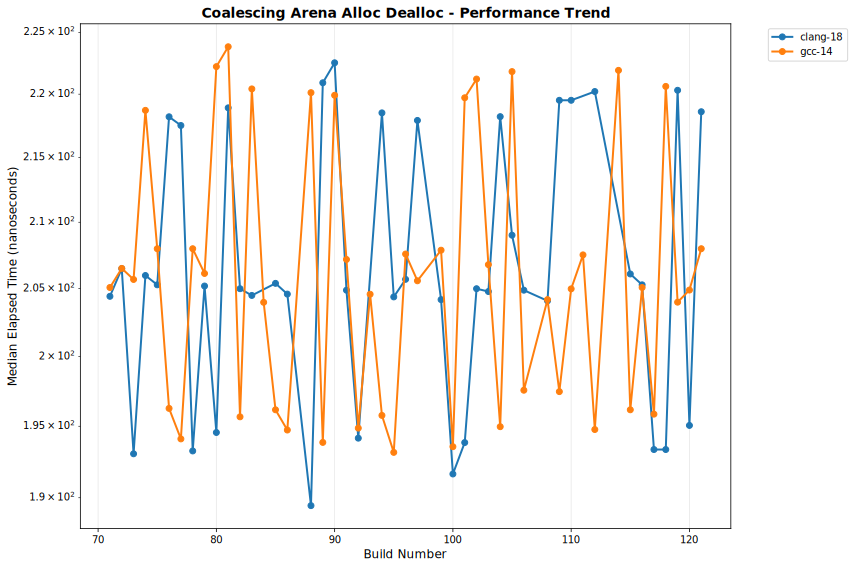

# OULY Performance Tracking

**Generated:** 2025-08-17 13:04:21 UTC

## 📊 Latest Performance Results

**Build Number:** 95
**Commit Hash:** bf2d20b3

### Scheduler Comparison

| Compiler | Benchmark | Median Time (ns) | Ops/sec | Error % |
|----------|-----------|------------------|---------|---------|
| gcc-14.2 | TaskSubmission_V1 | 145352.30 | 6880 | 0.00 |
| gcc-14.2 | TaskSubmission_V2 | 127367.70 | 7851 | 0.00 |
| gcc-14.2 | TaskSubmission_TBB | 246930.90 | 4050 | 0.00 |
| gcc-14.2 | ParallelFor_VectorOps_V1 | 219206.20 | 4562 | 0.00 |
| gcc-14.2 | ParallelFor_VectorOps_V2 | 230262.80 | 4343 | 0.00 |
| gcc-14.2 | ParallelFor_VectorOps_TBB | 236696.70 | 4225 | 0.00 |
| gcc-14.2 | MatrixOps_V1 | 174831.30 | 5720 | 0.00 |
| gcc-14.2 | MatrixOps_V2 | 162618.50 | 6149 | 0.00 |
| gcc-14.2 | MatrixOps_TBB | 161474.40 | 6193 | 0.00 |
| gcc-14.2 | MixedWorkload_V1 | 392132.80 | 2550 | 0.00 |
| gcc-14.2 | MixedWorkload_V2 | 445575.60 | 2244 | 0.00 |
| gcc-14.2 | MixedWorkload_TBB | 466279.20 | 2145 | 0.00 |
| gcc-14.2 | TaskThroughput_V1 | 51033781.90 | 20 | 0.00 |
| gcc-14.2 | TaskThroughput_V2 | 60775503.80 | 16 | 0.00 |
| gcc-14.2 | TaskThroughput_TBB | 51021526.80 | 20 | 0.00 |
| gcc-14.2 | NestedParallel_V1 | 116308.10 | 8598 | 0.00 |
| gcc-14.2 | NestedParallel_V2 | 134173.50 | 7453 | 0.00 |
| gcc-4.2 | TaskSubmission_V1 | 152971.10 | 6537 | 0.00 |
| gcc-4.2 | TaskSubmission_V2 | 124322.50 | 8044 | 0.00 |
| gcc-4.2 | TaskSubmission_TBB | 243558.60 | 4106 | 0.00 |
| gcc-4.2 | ParallelFor_VectorOps_V1 | 87878.40 | 11379 | 0.00 |
| gcc-4.2 | ParallelFor_VectorOps_V2 | 100755.50 | 9925 | 0.00 |
| gcc-4.2 | ParallelFor_VectorOps_TBB | 230925.90 | 4330 | 0.00 |
| gcc-4.2 | MatrixOps_V1 | 64867.30 | 15416 | 0.00 |
| gcc-4.2 | MatrixOps_V2 | 73428.30 | 13619 | 0.00 |
| gcc-4.2 | MatrixOps_TBB | 79685.00 | 12549 | 0.00 |
| gcc-4.2 | MixedWorkload_V1 | 236848.10 | 4222 | 0.00 |
| gcc-4.2 | MixedWorkload_V2 | 242755.10 | 4119 | 0.00 |
| gcc-4.2 | MixedWorkload_TBB | 418560.90 | 2389 | 0.00 |
| gcc-4.2 | TaskThroughput_V1 | 60005102.90 | 17 | 0.00 |
| gcc-4.2 | TaskThroughput_V2 | 71127902.70 | 14 | 0.00 |
| gcc-4.2 | TaskThroughput_TBB | 59993378.00 | 17 | 0.00 |
| gcc-4.2 | NestedParallel_V1 | 68596.30 | 14578 | 0.00 |
| gcc-4.2 | NestedParallel_V2 | 69278.60 | 14434 | 0.00 |

### Allocator Performance

| Compiler | Benchmark | Median Time (ns) | Ops/sec | Error % |
|----------|-----------|------------------|---------|---------|
| gcc-14 | ts_shared_linear_single_thread | 6.01 | 166389351 | 0.00 |
| gcc-14 | ts_thread_local_single_thread | 4.31 | 232018561 | 0.00 |
| gcc-14 | coalescing_arena_alloc_dealloc | 193.16 | 5177055 | 0.00 |
| clang-18 | ts_shared_linear_single_thread | 6.31 | 158478605 | 0.00 |
| clang-18 | ts_thread_local_single_thread | 4.21 | 237529691 | 0.00 |
| clang-18 | coalescing_arena_alloc_dealloc | 204.38 | 4892847 | 0.00 |

## 📈 Performance Trends

The following charts show performance trends over build numbers, 
with build number on the X-axis and performance metrics on the Y-axis.
Performance is grouped by measurement type.

### Coalescingarenaallocdealloc Performance

#### Execution Time

#### Throughput

### Matrixops Performance

#### Execution Time

#### Throughput

### Mixedworkload Performance

#### Execution Time

#### Throughput

### Nestedparallel Performance

#### Execution Time

#### Throughput

### Parallelforvectorops Performance

#### Execution Time

#### Throughput

### Tasksubmission Performance

#### Execution Time

#### Throughput

### Taskthroughput Performance

#### Execution Time

#### Throughput

### Tssharedlinearsinglethread Performance

#### Execution Time

#### Throughput

### Tsthreadlocalsinglethread Performance

#### Execution Time

#### Throughput

## 📋 Data Summary

- **Total benchmark runs:** 920
- **Build range:** 71 - 95
- **Date range:** 2025-08-17 to 2025-08-17
- **Compilers tested:** clang-18, gcc-14, gcc-14.2, gcc-4.2
- **Test categories:** allocator_performance, scheduler_comparison

---
*This report is automatically generated from benchmark results stored in the perfo branch.*