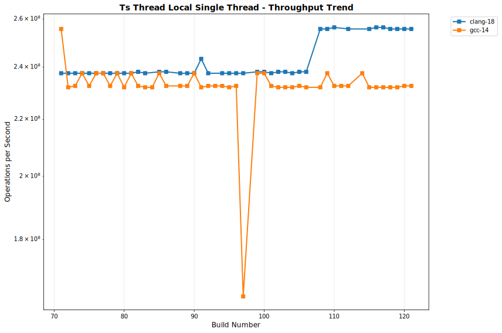

# OULY Performance Tracking

**Generated:** 2025-08-13 20:43:10 UTC

## 📊 Latest Performance Results

**Build Number:** 85
**Commit Hash:** 93b66ae0

### Allocator Performance

| Compiler | Benchmark | Median Time (ns) | Ops/sec | Error % |
|----------|-----------|------------------|---------|---------|
| gcc-14 | ts_shared_linear_single_thread | 6.01 | 166389351 | 0.00 |
| gcc-14 | ts_thread_local_single_thread | 4.21 | 237529691 | 0.00 |
| gcc-14 | coalescing_arena_alloc_dealloc | 196.17 | 5097619 | 0.00 |
| clang-18 | ts_shared_linear_single_thread | 6.31 | 158478605 | 0.00 |
| clang-18 | ts_thread_local_single_thread | 4.20 | 238095238 | 0.00 |
| clang-18 | coalescing_arena_alloc_dealloc | 205.39 | 4868786 | 0.00 |

### Scheduler Comparison

| Compiler | Benchmark | Median Time (ns) | Ops/sec | Error % |
|----------|-----------|------------------|---------|---------|
| gcc-4.2 | TaskSubmission_V1 | 130755.10 | 7648 | 0.00 |
| gcc-4.2 | TaskSubmission_V2 | 109534.30 | 9130 | 0.00 |
| gcc-4.2 | TaskSubmission_TBB | 157722.60 | 6340 | 0.00 |
| gcc-4.2 | ParallelFor_VectorOps_V1 | 88075.10 | 11354 | 0.00 |
| gcc-4.2 | ParallelFor_VectorOps_V2 | 100159.80 | 9984 | 0.00 |
| gcc-4.2 | ParallelFor_VectorOps_TBB | 230605.30 | 4336 | 0.00 |
| gcc-4.2 | MatrixOps_V1 | 74303.30 | 13458 | 0.00 |
| gcc-4.2 | MatrixOps_V2 | 75397.30 | 13263 | 0.00 |
| gcc-4.2 | MatrixOps_TBB | 79830.38 | 12527 | 0.00 |
| gcc-4.2 | MixedWorkload_V1 | 267757.80 | 3735 | 0.00 |
| gcc-4.2 | MixedWorkload_V2 | 587977.00 | 1701 | 0.00 |
| gcc-4.2 | MixedWorkload_TBB | 409606.80 | 2441 | 0.00 |
| gcc-4.2 | TaskThroughput_V1 | 60160855.80 | 17 | 0.00 |
| gcc-4.2 | TaskThroughput_V2 | 72851341.80 | 14 | 0.00 |
| gcc-4.2 | TaskThroughput_TBB | 60118126.30 | 17 | 0.00 |
| gcc-4.2 | NestedParallel_V1 | 62796.60 | 15924 | 0.00 |
| gcc-4.2 | NestedParallel_V2 | 69287.90 | 14433 | 0.00 |
| gcc-14.2 | TaskSubmission_V1 | 137036.20 | 7297 | 0.00 |
| gcc-14.2 | TaskSubmission_V2 | 116350.60 | 8595 | 0.00 |
| gcc-14.2 | TaskSubmission_TBB | 153699.40 | 6506 | 0.00 |
| gcc-14.2 | ParallelFor_VectorOps_V1 | 219371.20 | 4558 | 0.00 |
| gcc-14.2 | ParallelFor_VectorOps_V2 | 227805.00 | 4390 | 0.00 |
| gcc-14.2 | ParallelFor_VectorOps_TBB | 224407.60 | 4456 | 0.00 |
| gcc-14.2 | MatrixOps_V1 | 108448.80 | 9221 | 0.00 |
| gcc-14.2 | MatrixOps_V2 | 120959.88 | 8267 | 0.00 |
| gcc-14.2 | MatrixOps_TBB | 113056.89 | 8845 | 0.00 |
| gcc-14.2 | MixedWorkload_V1 | 364980.50 | 2740 | 0.00 |
| gcc-14.2 | MixedWorkload_V2 | 401393.60 | 2491 | 0.00 |
| gcc-14.2 | MixedWorkload_TBB | 247007.90 | 4048 | 0.00 |
| gcc-14.2 | TaskThroughput_V1 | 51308166.80 | 19 | 0.00 |
| gcc-14.2 | TaskThroughput_V2 | 60758455.20 | 16 | 0.00 |
| gcc-14.2 | TaskThroughput_TBB | 51075259.10 | 20 | 0.00 |
| gcc-14.2 | NestedParallel_V1 | 126632.80 | 7897 | 0.00 |
| gcc-14.2 | NestedParallel_V2 | 128765.80 | 7766 | 0.00 |

## 📈 Performance Trends

The following charts show performance trends over build numbers, 
with build number on the X-axis and performance metrics on the Y-axis.
Performance is grouped by measurement type.

### Coalescingarenaallocdealloc Performance

#### Execution Time

#### Throughput

### Matrixops Performance

#### Execution Time

#### Throughput

### Mixedworkload Performance

#### Execution Time

#### Throughput

### Nestedparallel Performance

#### Execution Time

#### Throughput

### Parallelforvectorops Performance

#### Execution Time

#### Throughput

### Tasksubmission Performance

#### Execution Time

#### Throughput

### Taskthroughput Performance

#### Execution Time

#### Throughput

### Tssharedlinearsinglethread Performance

#### Execution Time

#### Throughput

### Tsthreadlocalsinglethread Performance

#### Execution Time

#### Throughput

## 📋 Data Summary

- **Total benchmark runs:** 580
- **Build range:** 71 - 85
- **Date range:** 2025-08-13 to 2025-08-13
- **Compilers tested:** clang-18, gcc-14, gcc-14.2, gcc-4.2
- **Test categories:** allocator_performance, scheduler_comparison

---
*This report is automatically generated from benchmark results stored in the perfo branch.*