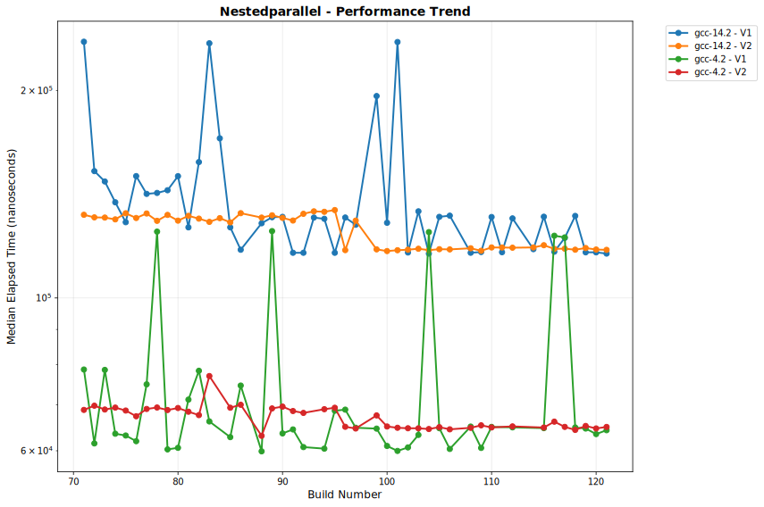

# OULY Performance Tracking

**Generated:** 2025-08-03 02:52:36 UTC

## 📊 Latest Performance Results

**Build Number:** 77
**Commit Hash:** 5ab3cce2

### Allocator Performance

| Compiler | Benchmark | Median Time (ns) | Ops/sec | Error % |
|----------|-----------|------------------|---------|---------|
| gcc-14 | ts_shared_linear_single_thread | 6.02 | 166112957 | 0.00 |
| gcc-14 | ts_thread_local_single_thread | 4.21 | 237529691 | 0.00 |
| gcc-14 | coalescing_arena_alloc_dealloc | 194.11 | 5151790 | 0.00 |
| clang-18 | ts_shared_linear_single_thread | 6.31 | 158478605 | 0.00 |
| clang-18 | ts_thread_local_single_thread | 4.21 | 237529691 | 0.00 |
| clang-18 | coalescing_arena_alloc_dealloc | 217.51 | 4597490 | 0.00 |

### Scheduler Comparison

| Compiler | Benchmark | Median Time (ns) | Ops/sec | Error % |
|----------|-----------|------------------|---------|---------|
| gcc-4.2 | TaskSubmission_V1 | 134495.50 | 7435 | 0.00 |
| gcc-4.2 | TaskSubmission_V2 | 116018.10 | 8619 | 0.00 |
| gcc-4.2 | TaskSubmission_TBB | 164355.10 | 6084 | 0.00 |
| gcc-4.2 | ParallelFor_VectorOps_V1 | 88163.30 | 11343 | 0.00 |
| gcc-4.2 | ParallelFor_VectorOps_V2 | 99736.80 | 10026 | 0.00 |
| gcc-4.2 | ParallelFor_VectorOps_TBB | 230984.20 | 4329 | 0.00 |
| gcc-4.2 | MatrixOps_V1 | 64827.80 | 15425 | 0.00 |
| gcc-4.2 | MatrixOps_V2 | 74256.40 | 13467 | 0.00 |
| gcc-4.2 | MatrixOps_TBB | 79503.10 | 12578 | 0.00 |
| gcc-4.2 | MixedWorkload_V1 | 236558.70 | 4227 | 0.00 |
| gcc-4.2 | MixedWorkload_V2 | 239427.00 | 4177 | 0.00 |
| gcc-4.2 | MixedWorkload_TBB | 263157.20 | 3800 | 0.00 |
| gcc-4.2 | TaskThroughput_V1 | 60222198.40 | 17 | 0.00 |
| gcc-4.2 | TaskThroughput_V2 | 71202733.90 | 14 | 0.00 |
| gcc-4.2 | TaskThroughput_TBB | 60014745.40 | 17 | 0.00 |
| gcc-4.2 | NestedParallel_V1 | 74922.50 | 13347 | 0.00 |
| gcc-4.2 | NestedParallel_V2 | 68999.50 | 14493 | 0.00 |
| gcc-14.2 | TaskSubmission_V1 | 156260.20 | 6400 | 0.00 |
| gcc-14.2 | TaskSubmission_V2 | 119282.30 | 8383 | 0.00 |
| gcc-14.2 | TaskSubmission_TBB | 219271.60 | 4561 | 0.00 |
| gcc-14.2 | ParallelFor_VectorOps_V1 | 219112.20 | 4564 | 0.00 |
| gcc-14.2 | ParallelFor_VectorOps_V2 | 227143.30 | 4403 | 0.00 |
| gcc-14.2 | ParallelFor_VectorOps_TBB | 223886.20 | 4467 | 0.00 |
| gcc-14.2 | MatrixOps_V1 | 108503.20 | 9216 | 0.00 |
| gcc-14.2 | MatrixOps_V2 | 125425.70 | 7973 | 0.00 |
| gcc-14.2 | MatrixOps_TBB | 140428.70 | 7121 | 0.00 |
| gcc-14.2 | MixedWorkload_V1 | 312591.40 | 3199 | 0.00 |
| gcc-14.2 | MixedWorkload_V2 | 250386.50 | 3994 | 0.00 |
| gcc-14.2 | MixedWorkload_TBB | 243426.50 | 4108 | 0.00 |
| gcc-14.2 | TaskThroughput_V1 | 51110509.40 | 20 | 0.00 |
| gcc-14.2 | TaskThroughput_V2 | 65879639.30 | 15 | 0.00 |
| gcc-14.2 | TaskThroughput_TBB | 51084651.00 | 20 | 0.00 |
| gcc-14.2 | NestedParallel_V1 | 141622.80 | 7061 | 0.00 |
| gcc-14.2 | NestedParallel_V2 | 132638.10 | 7539 | 0.00 |

## 📈 Performance Trends

The following charts show performance trends over build numbers, 
with build number on the X-axis and performance metrics on the Y-axis.
Performance is grouped by measurement type.

### Coalescingarenaallocdealloc Performance

#### Execution Time

#### Throughput

### Matrixops Performance

#### Execution Time

#### Throughput

### Mixedworkload Performance

#### Execution Time

#### Throughput

### Nestedparallel Performance

#### Execution Time

#### Throughput

### Parallelforvectorops Performance

#### Execution Time

#### Throughput

### Tasksubmission Performance

#### Execution Time

#### Throughput

### Taskthroughput Performance

#### Execution Time

#### Throughput

### Tssharedlinearsinglethread Performance

#### Execution Time

#### Throughput

### Tsthreadlocalsinglethread Performance

#### Execution Time

#### Throughput

## 📋 Data Summary

- **Total benchmark runs:** 280
- **Build range:** 71 - 77
- **Date range:** 2025-08-03 to 2025-08-03
- **Compilers tested:** gcc-14, clang-18, gcc-14.2, gcc-4.2
- **Test categories:** allocator_performance, scheduler_comparison

---
*This report is automatically generated from benchmark results stored in the perfo branch.*