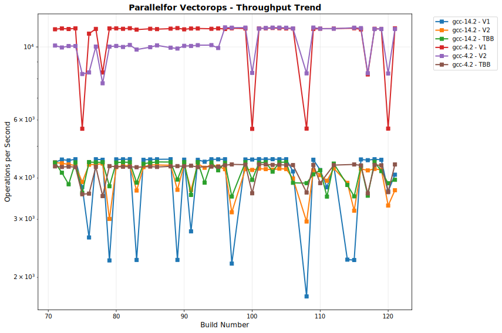

# OULY Performance Tracking

**Generated:** 2025-08-02 18:18:29 UTC

## 📊 Latest Performance Results

**Build Number:** 75
**Commit Hash:** 97860a6f

### Allocator Performance

| Compiler | Benchmark | Median Time (ns) | Ops/sec | Error % |
|----------|-----------|------------------|---------|---------|
| clang-18 | ts_shared_linear_single_thread | 6.21 | 161030596 | 0.00 |
| clang-18 | ts_thread_local_single_thread | 4.21 | 237529691 | 0.00 |
| clang-18 | coalescing_arena_alloc_dealloc | 205.28 | 4871395 | 0.00 |
| gcc-14 | ts_shared_linear_single_thread | 6.01 | 166389351 | 0.00 |
| gcc-14 | ts_thread_local_single_thread | 4.30 | 232558140 | 0.00 |
| gcc-14 | coalescing_arena_alloc_dealloc | 207.99 | 4807923 | 0.00 |

### Scheduler Comparison

| Compiler | Benchmark | Median Time (ns) | Ops/sec | Error % |
|----------|-----------|------------------|---------|---------|
| gcc-14.2 | TaskSubmission_V1 | 173419.90 | 5766 | 0.00 |
| gcc-14.2 | TaskSubmission_V2 | 132219.14 | 7563 | 0.00 |
| gcc-14.2 | TaskSubmission_TBB | 168605.80 | 5931 | 0.00 |
| gcc-14.2 | ParallelFor_VectorOps_V1 | 266121.60 | 3758 | 0.00 |
| gcc-14.2 | ParallelFor_VectorOps_V2 | 256818.10 | 3894 | 0.00 |
| gcc-14.2 | ParallelFor_VectorOps_TBB | 276792.60 | 3613 | 0.00 |
| gcc-14.2 | MatrixOps_V1 | 214757.30 | 4656 | 0.00 |
| gcc-14.2 | MatrixOps_V2 | 164050.67 | 6096 | 0.00 |
| gcc-14.2 | MatrixOps_TBB | 178044.50 | 5617 | 0.00 |
| gcc-14.2 | MixedWorkload_V1 | 444965.50 | 2247 | 0.00 |
| gcc-14.2 | MixedWorkload_V2 | 381012.80 | 2625 | 0.00 |
| gcc-14.2 | MixedWorkload_TBB | 258582.40 | 3867 | 0.00 |
| gcc-14.2 | TaskThroughput_V1 | 51077080.10 | 20 | 0.00 |
| gcc-14.2 | TaskThroughput_V2 | 60938463.70 | 16 | 0.00 |
| gcc-14.2 | TaskThroughput_TBB | 51144661.60 | 20 | 0.00 |
| gcc-14.2 | NestedParallel_V1 | 128826.30 | 7762 | 0.00 |
| gcc-14.2 | NestedParallel_V2 | 132735.70 | 7534 | 0.00 |
| gcc-4.2 | TaskSubmission_V1 | 142971.10 | 6994 | 0.00 |
| gcc-4.2 | TaskSubmission_V2 | 127943.00 | 7816 | 0.00 |
| gcc-4.2 | TaskSubmission_TBB | 179097.80 | 5584 | 0.00 |
| gcc-4.2 | ParallelFor_VectorOps_V1 | 177057.10 | 5648 | 0.00 |
| gcc-4.2 | ParallelFor_VectorOps_V2 | 120783.50 | 8279 | 0.00 |
| gcc-4.2 | ParallelFor_VectorOps_TBB | 279749.60 | 3575 | 0.00 |
| gcc-4.2 | MatrixOps_V1 | 95212.60 | 10503 | 0.00 |
| gcc-4.2 | MatrixOps_V2 | 94578.30 | 10573 | 0.00 |
| gcc-4.2 | MatrixOps_TBB | 98782.30 | 10123 | 0.00 |
| gcc-4.2 | MixedWorkload_V1 | 429862.00 | 2326 | 0.00 |
| gcc-4.2 | MixedWorkload_V2 | 354525.80 | 2821 | 0.00 |
| gcc-4.2 | MixedWorkload_TBB | 354222.30 | 2823 | 0.00 |
| gcc-4.2 | TaskThroughput_V1 | 60051157.10 | 17 | 0.00 |
| gcc-4.2 | TaskThroughput_V2 | 65684954.40 | 15 | 0.00 |
| gcc-4.2 | TaskThroughput_TBB | 59950746.60 | 17 | 0.00 |
| gcc-4.2 | NestedParallel_V1 | 63141.40 | 15837 | 0.00 |
| gcc-4.2 | NestedParallel_V2 | 68637.93 | 14569 | 0.00 |

## 📈 Performance Trends

The following charts show performance trends over build numbers, 
with build number on the X-axis and performance metrics on the Y-axis.
Performance is grouped by measurement type.

### Coalescingarenaallocdealloc Performance

#### Execution Time

#### Throughput

### Matrixops Performance

#### Execution Time

#### Throughput

### Mixedworkload Performance

#### Execution Time

#### Throughput

### Nestedparallel Performance

#### Execution Time

#### Throughput

### Parallelforvectorops Performance

#### Execution Time

#### Throughput

### Tasksubmission Performance

#### Execution Time

#### Throughput

### Taskthroughput Performance

#### Execution Time

#### Throughput

### Tssharedlinearsinglethread Performance

#### Execution Time

#### Throughput

### Tsthreadlocalsinglethread Performance

#### Execution Time

#### Throughput

## 📋 Data Summary

- **Total benchmark runs:** 200
- **Build range:** 71 - 75
- **Date range:** 2025-08-02 to 2025-08-02
- **Compilers tested:** gcc-14, gcc-14.2, clang-18, gcc-4.2
- **Test categories:** allocator_performance, scheduler_comparison

---
*This report is automatically generated from benchmark results stored in the perfo branch.*