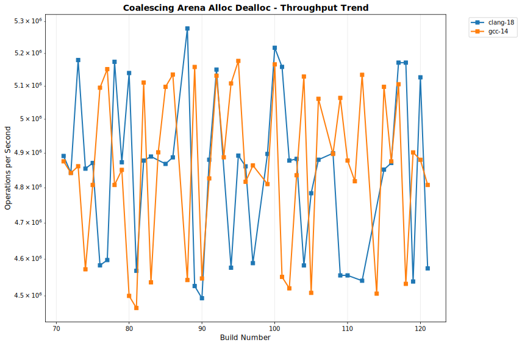

# OULY Performance Tracking

**Generated:** 2025-08-16 05:13:21 UTC

## 📊 Latest Performance Results

**Build Number:** 92
**Commit Hash:** b4454bb1

### Scheduler Comparison

| Compiler | Benchmark | Median Time (ns) | Ops/sec | Error % |
|----------|-----------|------------------|---------|---------|
| gcc-4.2 | TaskSubmission_V1 | 140959.80 | 7094 | 0.00 |
| gcc-4.2 | TaskSubmission_V2 | 114991.10 | 8696 | 0.00 |
| gcc-4.2 | TaskSubmission_TBB | 225441.90 | 4436 | 0.00 |
| gcc-4.2 | ParallelFor_VectorOps_V1 | 87895.50 | 11377 | 0.00 |
| gcc-4.2 | ParallelFor_VectorOps_V2 | 98764.80 | 10125 | 0.00 |
| gcc-4.2 | ParallelFor_VectorOps_TBB | 231466.10 | 4320 | 0.00 |
| gcc-4.2 | MatrixOps_V1 | 64987.60 | 15388 | 0.00 |
| gcc-4.2 | MatrixOps_V2 | 72557.80 | 13782 | 0.00 |
| gcc-4.2 | MatrixOps_TBB | 79693.10 | 12548 | 0.00 |
| gcc-4.2 | MixedWorkload_V1 | 236745.00 | 4224 | 0.00 |
| gcc-4.2 | MixedWorkload_V2 | 243017.80 | 4115 | 0.00 |
| gcc-4.2 | MixedWorkload_TBB | 349098.30 | 2865 | 0.00 |
| gcc-4.2 | TaskThroughput_V1 | 60117118.60 | 17 | 0.00 |
| gcc-4.2 | TaskThroughput_V2 | 67910008.10 | 15 | 0.00 |
| gcc-4.2 | TaskThroughput_TBB | 60053871.00 | 17 | 0.00 |
| gcc-4.2 | NestedParallel_V1 | 60741.70 | 16463 | 0.00 |
| gcc-4.2 | NestedParallel_V2 | 68096.40 | 14685 | 0.00 |
| gcc-14.2 | TaskSubmission_V1 | 145359.60 | 6879 | 0.00 |
| gcc-14.2 | TaskSubmission_V2 | 129993.90 | 7693 | 0.00 |
| gcc-14.2 | TaskSubmission_TBB | 167577.40 | 5967 | 0.00 |
| gcc-14.2 | ParallelFor_VectorOps_V1 | 220024.70 | 4545 | 0.00 |
| gcc-14.2 | ParallelFor_VectorOps_V2 | 225898.80 | 4427 | 0.00 |
| gcc-14.2 | ParallelFor_VectorOps_TBB | 223602.40 | 4472 | 0.00 |
| gcc-14.2 | MatrixOps_V1 | 108375.30 | 9227 | 0.00 |
| gcc-14.2 | MatrixOps_V2 | 124324.20 | 8043 | 0.00 |
| gcc-14.2 | MatrixOps_TBB | 113324.60 | 8824 | 0.00 |
| gcc-14.2 | MixedWorkload_V1 | 360578.40 | 2773 | 0.00 |
| gcc-14.2 | MixedWorkload_V2 | 372222.30 | 2687 | 0.00 |
| gcc-14.2 | MixedWorkload_TBB | 275753.20 | 3626 | 0.00 |
| gcc-14.2 | TaskThroughput_V1 | 51213576.30 | 20 | 0.00 |
| gcc-14.2 | TaskThroughput_V2 | 60631840.90 | 16 | 0.00 |
| gcc-14.2 | TaskThroughput_TBB | 51180306.90 | 20 | 0.00 |
| gcc-14.2 | NestedParallel_V1 | 116315.20 | 8597 | 0.00 |
| gcc-14.2 | NestedParallel_V2 | 132496.60 | 7547 | 0.00 |

### Allocator Performance

| Compiler | Benchmark | Median Time (ns) | Ops/sec | Error % |
|----------|-----------|------------------|---------|---------|
| clang-18 | ts_shared_linear_single_thread | 6.31 | 158478605 | 0.00 |
| clang-18 | ts_thread_local_single_thread | 4.21 | 237529691 | 0.00 |
| clang-18 | coalescing_arena_alloc_dealloc | 194.16 | 5150391 | 0.00 |
| gcc-14 | ts_shared_linear_single_thread | 6.02 | 166112957 | 0.00 |
| gcc-14 | ts_thread_local_single_thread | 4.30 | 232558140 | 0.00 |
| gcc-14 | coalescing_arena_alloc_dealloc | 194.87 | 5131626 | 0.00 |

## 📈 Performance Trends

The following charts show performance trends over build numbers, 
with build number on the X-axis and performance metrics on the Y-axis.
Performance is grouped by measurement type.

### Coalescingarenaallocdealloc Performance

#### Execution Time

#### Throughput

### Matrixops Performance

#### Execution Time

#### Throughput

### Mixedworkload Performance

#### Execution Time

#### Throughput

### Nestedparallel Performance

#### Execution Time

#### Throughput

### Parallelforvectorops Performance

#### Execution Time

#### Throughput

### Tasksubmission Performance

#### Execution Time

#### Throughput

### Taskthroughput Performance

#### Execution Time

#### Throughput

### Tssharedlinearsinglethread Performance

#### Execution Time

#### Throughput

### Tsthreadlocalsinglethread Performance

#### Execution Time

#### Throughput

## 📋 Data Summary

- **Total benchmark runs:** 820
- **Build range:** 71 - 92
- **Date range:** 2025-08-16 to 2025-08-16
- **Compilers tested:** clang-18, gcc-14, gcc-14.2, gcc-4.2
- **Test categories:** allocator_performance, scheduler_comparison

---
*This report is automatically generated from benchmark results stored in the perfo branch.*