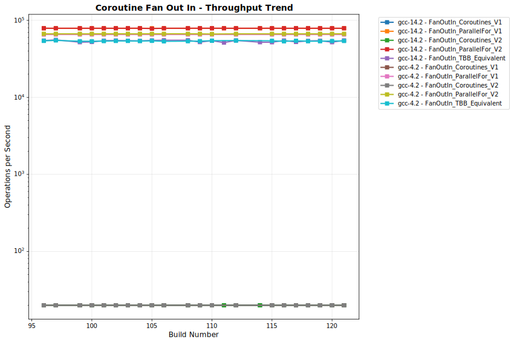

# OULY Performance Tracking

**Generated:** 2025-08-22 16:20:20 UTC

## 📊 Latest Performance Results

**Build Number:** 100
**Commit Hash:** 0639b2b9

### Overhead Comparison

| Compiler | Benchmark | Median Time (ns) | Ops/sec | Error % |
|----------|-----------|------------------|---------|---------|
| gcc-14.2 | CoroutineCreation_V1 | 578271.20 | 1729 | 0.00 |
| gcc-14.2 | CoroutineCreation_V2 | 554459.40 | 1804 | 0.00 |
| gcc-14.2 | CoroutineSubmission_V1 | 157499.70 | 6349 | 0.00 |
| gcc-14.2 | LambdaSubmission_V1 | 115967.90 | 8623 | 0.00 |
| gcc-14.2 | CoroutineSubmission_V2 | 228363.20 | 4379 | 0.00 |
| gcc-14.2 | LambdaSubmission_V2 | 158793.10 | 6298 | 0.00 |
| gcc-14.2 | SuspensionOverhead_V1 | 50062686.30 | 20 | 0.00 |
| gcc-14.2 | SuspensionOverhead_V2 | 50144806.50 | 20 | 0.00 |
| gcc-14.2 | CoroutineMemory_V1 | 7646672.60 | 131 | 0.00 |
| gcc-14.2 | CoroutineMemory_V2 | 7529248.30 | 133 | 0.00 |
| gcc-4.2 | CoroutineCreation_V1 | 516223.30 | 1937 | 0.00 |
| gcc-4.2 | CoroutineCreation_V2 | 519755.90 | 1924 | 0.00 |
| gcc-4.2 | CoroutineSubmission_V1 | 464494.80 | 2153 | 0.00 |
| gcc-4.2 | LambdaSubmission_V1 | 341154.60 | 2931 | 0.00 |
| gcc-4.2 | CoroutineSubmission_V2 | 173391.60 | 5767 | 0.00 |
| gcc-4.2 | LambdaSubmission_V2 | 165499.80 | 6042 | 0.00 |
| gcc-4.2 | SuspensionOverhead_V1 | 50068883.50 | 20 | 0.00 |
| gcc-4.2 | SuspensionOverhead_V2 | 50116793.20 | 20 | 0.00 |
| gcc-4.2 | CoroutineMemory_V1 | 9241486.00 | 108 | 0.00 |
| gcc-4.2 | CoroutineMemory_V2 | 9205620.10 | 109 | 0.00 |

### Allocator Performance

| Compiler | Benchmark | Median Time (ns) | Ops/sec | Error % |
|----------|-----------|------------------|---------|---------|
| gcc-14 | ts_shared_linear_single_thread | 6.01 | 166389351 | 0.00 |
| gcc-14 | ts_thread_local_single_thread | 4.21 | 237529691 | 0.00 |
| gcc-14 | coalescing_arena_alloc_dealloc | 193.56 | 5166357 | 0.00 |
| clang-18 | ts_shared_linear_single_thread | 6.31 | 158478605 | 0.00 |
| clang-18 | ts_thread_local_single_thread | 4.20 | 238095238 | 0.00 |
| clang-18 | coalescing_arena_alloc_dealloc | 191.65 | 5217845 | 0.00 |

### Scheduler Comparison

| Compiler | Benchmark | Median Time (ns) | Ops/sec | Error % |
|----------|-----------|------------------|---------|---------|
| gcc-14.2 | TaskSubmission_V1 | 161974.40 | 6174 | 0.00 |
| gcc-14.2 | TaskSubmission_V2 | 140526.30 | 7116 | 0.00 |
| gcc-14.2 | TaskSubmission_TBB | 159443.60 | 6272 | 0.00 |
| gcc-14.2 | ParallelFor_VectorOps_V1 | 219519.70 | 4555 | 0.00 |
| gcc-14.2 | ParallelFor_VectorOps_V2 | 236095.70 | 4236 | 0.00 |
| gcc-14.2 | ParallelFor_VectorOps_TBB | 253127.40 | 3951 | 0.00 |
| gcc-14.2 | MatrixOps_V1 | 126695.50 | 7893 | 0.00 |
| gcc-14.2 | MatrixOps_V2 | 169578.50 | 5897 | 0.00 |
| gcc-14.2 | MatrixOps_TBB | 140513.30 | 7117 | 0.00 |
| gcc-14.2 | MixedWorkload_V1 | 376889.50 | 2653 | 0.00 |
| gcc-14.2 | MixedWorkload_V2 | 342363.20 | 2921 | 0.00 |
| gcc-14.2 | MixedWorkload_TBB | 324303.40 | 3084 | 0.00 |
| gcc-14.2 | TaskThroughput_V1 | 51110558.00 | 20 | 0.00 |
| gcc-14.2 | TaskThroughput_V2 | 51130517.70 | 20 | 0.00 |
| gcc-14.2 | TaskThroughput_TBB | 51077949.40 | 20 | 0.00 |
| gcc-14.2 | NestedParallel_V1 | 128580.20 | 7777 | 0.00 |
| gcc-14.2 | NestedParallel_V2 | 116980.60 | 8548 | 0.00 |
| gcc-4.2 | TaskSubmission_V1 | 146247.90 | 6838 | 0.00 |
| gcc-4.2 | TaskSubmission_V2 | 146187.80 | 6841 | 0.00 |
| gcc-4.2 | TaskSubmission_TBB | 176924.20 | 5652 | 0.00 |
| gcc-4.2 | ParallelFor_VectorOps_V1 | 177216.70 | 5643 | 0.00 |
| gcc-4.2 | ParallelFor_VectorOps_V2 | 119841.44 | 8344 | 0.00 |
| gcc-4.2 | ParallelFor_VectorOps_TBB | 277891.60 | 3599 | 0.00 |
| gcc-4.2 | MatrixOps_V1 | 134633.20 | 7428 | 0.00 |
| gcc-4.2 | MatrixOps_V2 | 94768.80 | 10552 | 0.00 |
| gcc-4.2 | MatrixOps_TBB | 98824.40 | 10119 | 0.00 |
| gcc-4.2 | MixedWorkload_V1 | 434273.40 | 2303 | 0.00 |
| gcc-4.2 | MixedWorkload_V2 | 431216.70 | 2319 | 0.00 |
| gcc-4.2 | MixedWorkload_TBB | 269785.50 | 3707 | 0.00 |
| gcc-4.2 | TaskThroughput_V1 | 60293972.40 | 17 | 0.00 |
| gcc-4.2 | TaskThroughput_V2 | 60028962.70 | 17 | 0.00 |
| gcc-4.2 | TaskThroughput_TBB | 60077781.50 | 17 | 0.00 |
| gcc-4.2 | NestedParallel_V1 | 60971.56 | 16401 | 0.00 |
| gcc-4.2 | NestedParallel_V2 | 65073.40 | 15367 | 0.00 |

### Performance Comparison

| Compiler | Benchmark | Median Time (ns) | Ops/sec | Error % |
|----------|-----------|------------------|---------|---------|
| gcc-14.2 | ParallelCompute_Coroutines_V1 | 100085156.50 | 10 | 0.00 |
| gcc-14.2 | ParallelCompute_RegularTasks_V1 | 41053593.50 | 24 | 0.00 |
| gcc-14.2 | ParallelCompute_Coroutines_V2 | 100102537.30 | 10 | 0.00 |
| gcc-14.2 | ParallelCompute_RegularTasks_V2 | 41153892.80 | 24 | 0.00 |
| gcc-14.2 | TaskChaining_Coroutines_V1 | 100238096.00 | 10 | 0.00 |
| gcc-14.2 | TaskChaining_NestedSubmission_V1 | 1835178.80 | 545 | 0.00 |
| gcc-14.2 | TaskChaining_Coroutines_V2 | 100289034.50 | 10 | 0.00 |
| gcc-14.2 | TaskChaining_NestedSubmission_V2 | 1166025.70 | 858 | 0.00 |
| gcc-14.2 | FanOutIn_Coroutines_V1 | 50069214.40 | 20 | 0.00 |
| gcc-14.2 | FanOutIn_ParallelFor_V1 | 12689.70 | 78804 | 0.00 |
| gcc-14.2 | FanOutIn_Coroutines_V2 | 50147018.10 | 20 | 0.00 |
| gcc-14.2 | FanOutIn_ParallelFor_V2 | 12669.70 | 78928 | 0.00 |
| gcc-14.2 | TaskChaining_TBB_Equivalent | 122195.00 | 8184 | 0.00 |
| gcc-14.2 | FanOutIn_TBB_Equivalent | 19103.60 | 52346 | 0.00 |
| gcc-4.2 | ParallelCompute_Coroutines_V1 | 100080640.70 | 10 | 0.00 |
| gcc-4.2 | ParallelCompute_RegularTasks_V1 | 48040969.70 | 21 | 0.00 |
| gcc-4.2 | ParallelCompute_Coroutines_V2 | 100126845.30 | 10 | 0.00 |
| gcc-4.2 | ParallelCompute_RegularTasks_V2 | 48115662.80 | 21 | 0.00 |
| gcc-4.2 | TaskChaining_Coroutines_V1 | 100237072.00 | 10 | 0.00 |
| gcc-4.2 | TaskChaining_NestedSubmission_V1 | 1778452.90 | 562 | 0.00 |
| gcc-4.2 | TaskChaining_Coroutines_V2 | 100260455.60 | 10 | 0.00 |
| gcc-4.2 | TaskChaining_NestedSubmission_V2 | 1170517.90 | 854 | 0.00 |
| gcc-4.2 | FanOutIn_Coroutines_V1 | 50069126.30 | 20 | 0.00 |
| gcc-4.2 | FanOutIn_ParallelFor_V1 | 15275.50 | 65464 | 0.00 |
| gcc-4.2 | FanOutIn_Coroutines_V2 | 50114705.70 | 20 | 0.00 |
| gcc-4.2 | FanOutIn_ParallelFor_V2 | 14974.90 | 66778 | 0.00 |
| gcc-4.2 | TaskChaining_TBB_Equivalent | 256929.50 | 3892 | 0.00 |
| gcc-4.2 | FanOutIn_TBB_Equivalent | 18689.90 | 53505 | 0.00 |

## 📈 Performance Trends

The following charts show performance trends over build numbers, 
with build number on the X-axis and performance metrics on the Y-axis.
Performance is grouped by measurement type.

### Coalescingarenaallocdealloc Performance

**Coalescing Arena Allocator Performance**

Measures the performance of the coalescing arena allocator, which manages memory by coalescing adjacent free blocks to reduce fragmentation. This benchmark tests allocation and deallocation operations using the arena-based memory management system. Lower times indicate better allocator performance.

#### Execution Time

#### Throughput

### Coroutine Creation Performance

**Coroutine Creation Overhead**

Measures the fundamental cost of creating coroutine objects compared to regular function calls. This includes coroutine frame allocation, initial suspension setup, and coroutine handle creation. Tests both V1 and V2 scheduler implementations to identify any scheduler-specific overhead in coroutine management. Lower creation times enable efficient use of coroutines for fine-grained asynchronous operations.

#### Execution Time

#### Throughput

### Coroutine Fan Out In Performance

**Coroutine Fan-Out/Fan-In Patterns**

Evaluates the performance of scatter-gather patterns implemented using coroutines compared to traditional parallel_for constructs and TBB equivalents. Tests scenarios where work is distributed across multiple coroutines and results are collected back. Critical for understanding coroutine performance in data-parallel and map-reduce style algorithms.

#### Execution Time

#### Throughput

### Coroutine Memory Performance

**Coroutine Memory Overhead**

Evaluates the memory allocation overhead of creating large numbers of coroutines simultaneously. Tests coroutine frame allocation patterns, memory fragmentation effects, and the efficiency of the coroutine memory management system. Important for applications that create many concurrent coroutines and need to understand memory scalability characteristics.

#### Execution Time

#### Throughput

### Coroutine Parallel Compute Performance

**Coroutine vs Regular Task Parallel Computation**

Compares coroutine-based parallel computation against traditional task-based approaches for CPU-intensive workloads. Measures whether coroutines introduce significant overhead when used for computational tasks versus their traditional use for I/O-bound operations. Tests both scheduler versions to identify performance differences in computational contexts.

#### Execution Time

#### Throughput

### Coroutine Submission Performance

**Coroutine vs Lambda Submission**

Compares the submission overhead of coroutines versus equivalent lambda functions to the task scheduler. Measures the cost of packaging coroutines as schedulable tasks including any additional metadata, type erasure, and scheduler integration overhead. Helps quantify the runtime cost difference between coroutine-based and traditional callback-based asynchronous patterns.

#### Execution Time

#### Throughput

### Coroutine Suspension Performance

**Coroutine Suspension/Resumption Overhead**

Measures the performance cost of coroutine suspension points and subsequent resumption. This includes saving coroutine state, yielding control back to the scheduler, and later restoring execution context. Critical for understanding the overhead of using 'co_await' constructs and designing efficient coroutine-based control flow.

#### Execution Time

#### Throughput

### Coroutine Task Chaining Performance

**Coroutine Task Chaining Performance**

Benchmarks sequential task dependencies implemented using coroutines versus traditional nested task submission patterns. Measures the efficiency of coroutine-based pipelines where each stage waits for the previous stage to complete. Compares against both manual task chaining and TBB equivalent implementations to understand the performance trade-offs.

#### Execution Time

#### Throughput

### Matrixops Performance

**Matrix Operations Performance**

Evaluates parallel matrix computations including transformations, multiplications, and other linear algebra operations. Tests the scheduler's performance on computationally intensive tasks that benefit from parallel execution. Includes both CPU-bound calculations and memory access patterns typical of numerical computing workloads.

#### Execution Time

#### Throughput

### Mixedworkload Performance

**Mixed Workload Performance**

Tests scheduler performance under heterogeneous workloads combining different types of tasks: I/O-bound, CPU-bound, memory-intensive, and short-duration tasks. Measures the scheduler's ability to handle diverse work characteristics simultaneously while maintaining good load balancing and thread utilization.

#### Execution Time

#### Throughput

### Nestedparallel Performance

**Nested Parallel Execution**

Benchmarks performance when parallel constructs are nested within other parallel regions. Tests the scheduler's handling of hierarchical parallelism, including dynamic thread allocation, work stealing across nested contexts, and avoiding oversubscription. Critical for applications using recursive parallel algorithms.

#### Execution Time

#### Throughput

### Parallelforvectorops Performance

**Parallel For Vector Operations**

Benchmarks parallel execution of vector operations using the auto_parallel_for construct. Tests the scheduler's ability to efficiently distribute vector computations across worker threads, including work stealing and load balancing. Measures both the overhead of parallelization and the effectiveness of parallel execution for computational workloads.

#### Execution Time

#### Throughput

### Tasksubmission Performance

**Task Submission Performance**

Measures the overhead of submitting tasks to the scheduler work queues. This includes the time to package work items, enqueue them into the scheduler's internal data structures, and wake up worker threads. Lower submission times enable better work distribution and reduced latency for fine-grained parallel workloads.

#### Execution Time

#### Throughput

### Taskthroughput Performance

**Task Throughput Measurement**

Measures the maximum task processing rate (tasks per second) that the scheduler can sustain. Uses minimal-work tasks to focus on scheduler overhead rather than computation time. Higher throughput indicates better efficiency in task management, queue operations, and thread coordination mechanisms.

#### Execution Time

#### Throughput

### Tssharedlinearsinglethread Performance

**Thread-Safe Shared Linear Allocator (Single Thread)**

Tests the performance of a thread-safe shared linear allocator when used in single-threaded scenarios. Linear allocators provide O(1) allocation by simply incrementing a pointer, but this variant includes thread-safety mechanisms. Measures the overhead of synchronization primitives when not actually needed (single-threaded usage).

#### Execution Time

#### Throughput

### Tsthreadlocalsinglethread Performance

**Thread-Safe Thread-Local Allocator (Single Thread)**

Evaluates a thread-local allocator's performance in single-threaded contexts. Thread-local allocators avoid synchronization overhead by maintaining separate memory pools per thread. This benchmark shows the baseline performance when thread-local storage is accessed from the owning thread.

#### Execution Time

#### Throughput

## 📋 Data Summary

- **Total benchmark runs:** 1272
- **Build range:** 71 - 100
- **Date range:** 2025-08-22 to 2025-08-22
- **Compilers tested:** clang-18, gcc-14, gcc-14.2, gcc-4.2
- **Test categories:** allocator_performance, scheduler_comparison, overhead_comparison, performance_comparison

---
*This report is automatically generated from benchmark results stored in the perfo branch.*