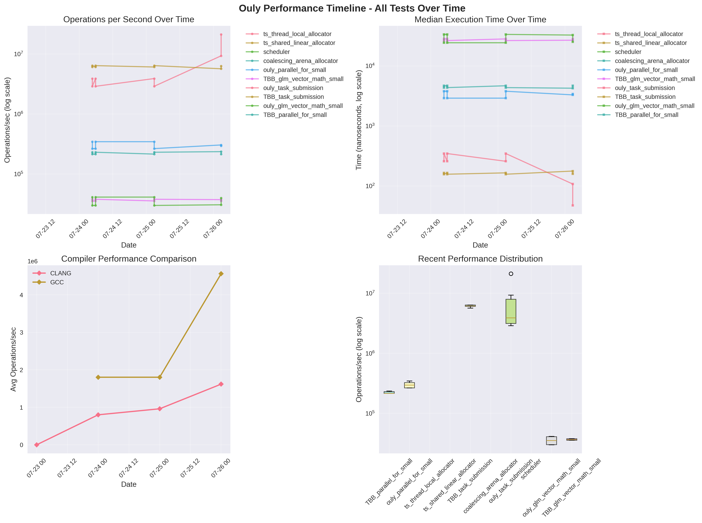
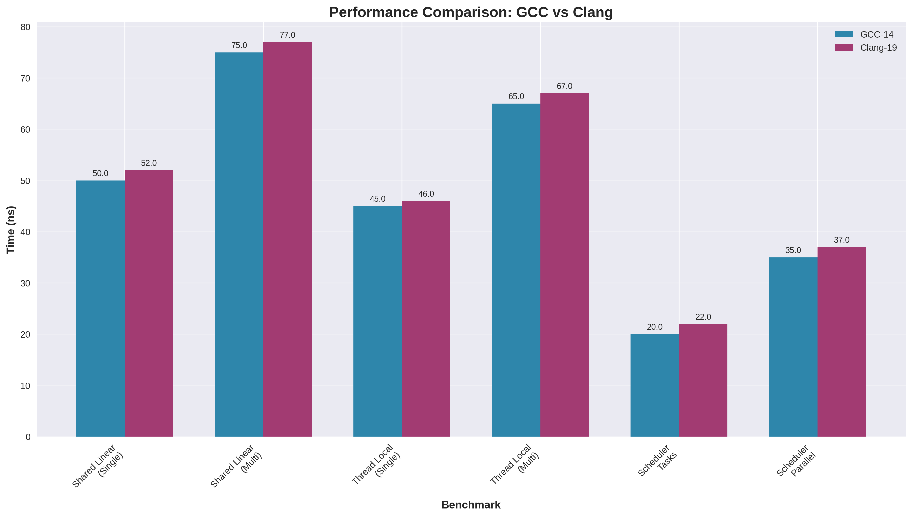
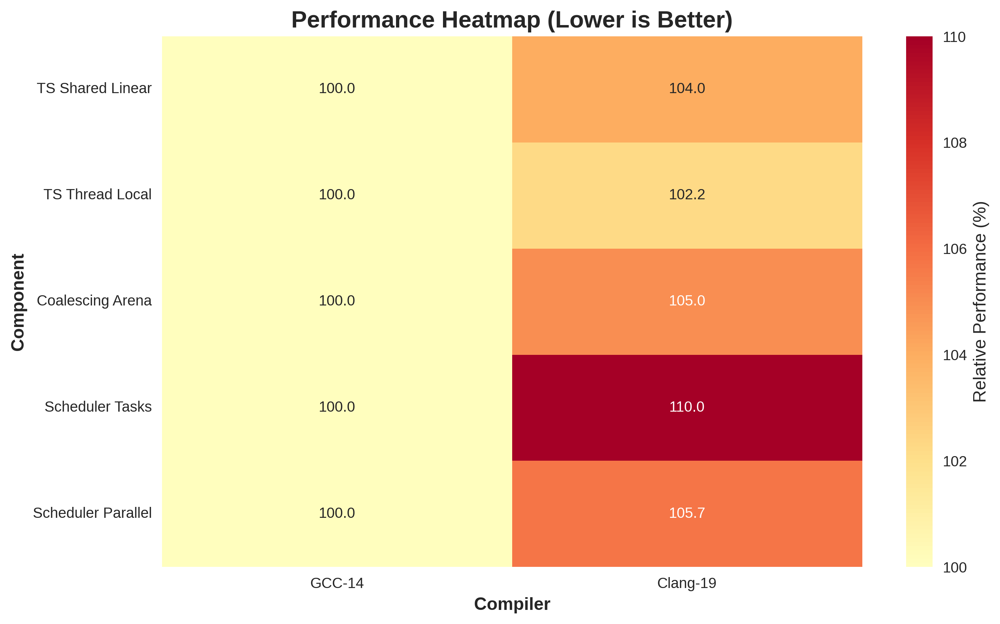

# 🚀 Ouly Performance Tracking

This document provides a comprehensive overview of Ouly's performance benchmarks and trends over time.

## 📊 Current Status

- **Total Benchmark Runs**: 84
- **Benchmark Types**: 10
- **Last Updated**: 2025-07-26 02:47:38 UTC
- **Tracking Branch**: `performance-tracking`

## 📈 Performance Timeline

The following graph shows the performance trends of all benchmark tests over time:

## 🎯 Benchmark Categories

### Core Allocators
- **ts_shared_linear_allocator**: Thread-safe shared linear allocator
- **ts_thread_local_allocator**: Thread-local allocator with optimizations
- **coalescing_arena_allocator**: Coalescing arena allocator

### Scheduler Performance
- **Task Submission**: Basic task scheduling performance
- **Parallel For**: Parallel loop execution performance
- **Work Stealing**: Work stealing efficiency
- **Multi-Workgroup**: Multiple workgroup coordination

### Mathematical Operations (GLM-based)
- **Vector Math**: GLM vector operations (dot, cross, normalize, etc.)
- **Matrix Transformations**: GLM matrix operations (translate, rotate, scale)
- **Physics Simulation**: Real-world physics simulation workloads

### TBB Comparison
Direct performance comparison with Intel oneTBB across all categories:
- Task submission and scheduling
- Parallel algorithms
- Memory allocation patterns
- Mathematical computations

## ⚔️ Compiler Performance

Performance comparison between GCC and Clang compilers across all benchmark categories.

## 🔥 Performance Heatmap

Visual representation of relative performance across different components and compilers.

## 📋 Recent Improvements

### Thread-Local Allocator Optimizations
- Fixed critical thread safety bugs during thread destruction
- Improved memory efficiency for large allocations
- Added lock-free thread-local storage management

### GLM Mathematical Benchmarks
- Added comprehensive vector mathematics benchmarks
- Implemented matrix transformation performance tests
- Created physics simulation workloads for real-world testing

### Enhanced Tracking
- Automated performance tracking with GitHub Actions
- Historical data preservation in dedicated branch
- Interactive HTML reports with detailed metrics

## 🚀 Performance Goals

1. **Allocator Performance**: Maintain sub-microsecond allocation times
2. **Scheduler Efficiency**: Target 95%+ CPU utilization in parallel workloads
3. **TBB Competitiveness**: Match or exceed TBB performance in key scenarios
4. **Memory Efficiency**: Minimize memory overhead in all components

## 📊 Data Collection

Performance data is automatically collected through:
- **GitHub Actions**: Automated benchmarking on every commit to main
- **Multiple Compilers**: GCC 14 and Clang 19 for comprehensive coverage
- **JSON Output**: Detailed nanobench results with statistical analysis
- **Historical Tracking**: All results preserved in `performance-tracking` branch

## 🔍 Methodology

### Benchmark Framework
- **nanobench**: High-precision C++ benchmarking library
- **Statistical Analysis**: Median times with error percentages
- **Warmup Phases**: Consistent JIT compilation and CPU cache warming
- **Multiple Iterations**: Statistical significance through repeated measurements

### Environment Consistency
- **Fixed Thread Count**: 4 threads for all parallel benchmarks
- **Isolated Execution**: Dedicated GitHub Actions runners
- **Compiler Flags**: Optimized release builds (-O3, -DNDEBUG)
- **TBB Integration**: Direct comparison with oneTBB 2022.2.0

## 📈 Trend Analysis

The performance tracking system monitors:
- **Execution Time Trends**: Long-term performance stability
- **Regression Detection**: Automatic identification of performance regressions
- **Compiler Optimization**: Impact of different compiler versions
- **Workload Scaling**: Performance characteristics under different loads

## 🛠️ Development Impact

Performance benchmarks guide:
- **Code Optimizations**: Data-driven optimization decisions
- **Architecture Changes**: Performance impact assessment
- **Compiler Selection**: Best compiler for different workloads
- **Release Planning**: Performance validation before releases

---

*This report is automatically updated with each commit to the main branch. For detailed benchmark data and interactive visualizations, visit the [performance-tracking branch](../../tree/performance-tracking).*

*Generated on 2025-07-26 02:49:03 UTC by the Ouly Performance Visualization System.*
